# WanderDesa — System Design

**Document ID:** `04-SYSTEM-DESIGN`  
**File:** `docs/04-SYSTEM-DESIGN.md`  
**Status:** Architecture design (pre-implementation)  
**Based on:** `docs/01-PRODUCT-VALIDATION.md`, `docs/02-PRD.md`, `docs/03-SRS.md`  
**Code in this phase:** **None**

---

## 0. Design Principles (binding)

1. WanderDesa is **one integrated system**, not “Flutter app + Laravel website.”
2. Backend shape: **modular monolith** (Laravel 13.x).
3. **No separate business logic** for Flutter Kiosk vs Laravel Dashboard.
4. Both channels call the **same Laravel business layer** (shared actions/services).
5. Clients are UX/transport only; Laravel decides, calculates, persists, returns authority.
6. **No microservices** for MVP without strong justification.
7. Prefer simple adapters for payment/hardware over premature abstraction.

| Baseline | Choice |
|---|---|
| Backend | Laravel 13.x modular monolith |
| PHP | 8.4.x |
| DB | MySQL 8.4.x |
| Kiosk | Flutter physical terminal client |
| Dashboard | Blade + Livewire + Tailwind |
| Auth | Session (staff) + Sanctum (kiosk/API) |
| Deploy | VPS |

---

## 1. Architecture Overview

WanderDesa is a **modular integrated tourism system**:

| Layer | Responsibility |
|---|---|
| Presentation — Kiosk | Flutter terminal UI, device peripherals, local UX state |
| Presentation — Dashboard | Blade/Livewire staff UI, scanners at counter/gate desk |
| Application / Transport | REST API controllers + Livewire entrypoints (thin) |
| Business / Domain | Shared actions & domain services (authority) |
| Integration | Payment, printer, scanner, gate, CCTV/AI adapters |
| Infrastructure | MySQL, cache, queue, logs, files, scheduler |
| Operations | Device fleet, audit, reports, backups |

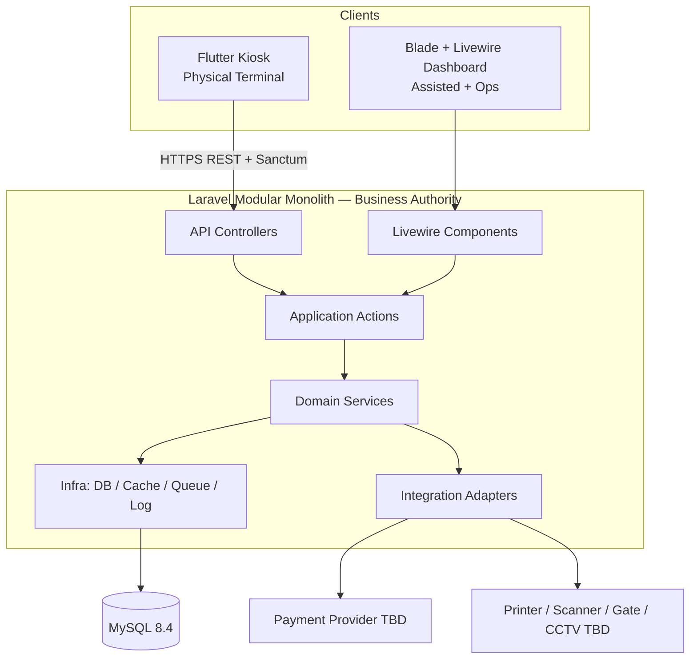

**Critical rule:** Pricing, payment finality, ticket issuance, QR validity, check-in, and permissions exist only in `APP`/`DOM`, never duplicated in Kiosk or Dashboard.

---

## 2. System Context Diagram

```mermaid
C4Context
  title WanderDesa System Context
```

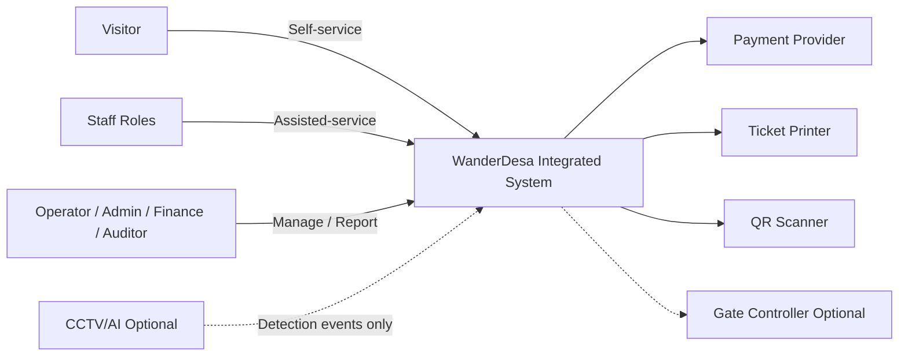

### Actors

| Actor | Interaction |
|---|---|
| Visitor | Buys via kiosk; enters via QR |
| Ticket Officer | Assisted sale on dashboard |
| Gate Officer | Validate/check-in |
| Operator | Kiosk fleet health |
| Manager / Finance / Auditor / Admin / SysAdmin | Config, reports, audit, security |

---

## 3. Component Diagram

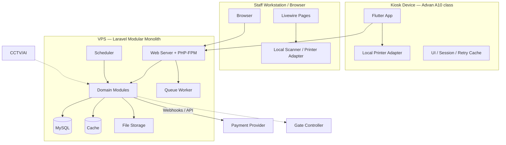

---

## 4. Application Architecture

Pattern: **Modular Monolith + Thin Transport + Shared Actions**

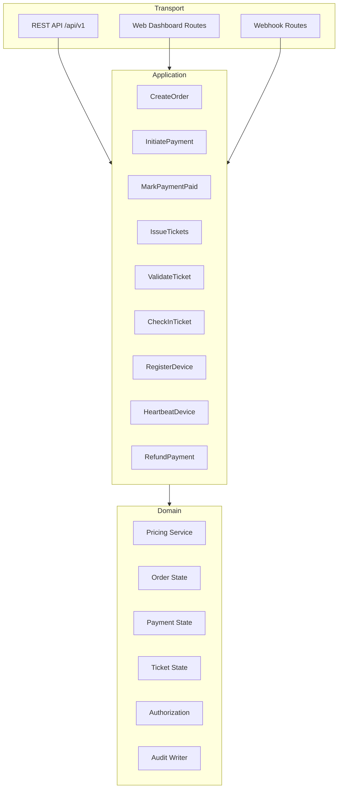

| Rule | Detail |
|---|---|
| Same actions | Kiosk REST and Dashboard Livewire invoke the same application actions |
| No channel fork | Channel is metadata (`kiosk` \| `assisted`), not a logic fork |
| No microservice | One deployable Laravel app for MVP |

---

## 5. Backend Architecture

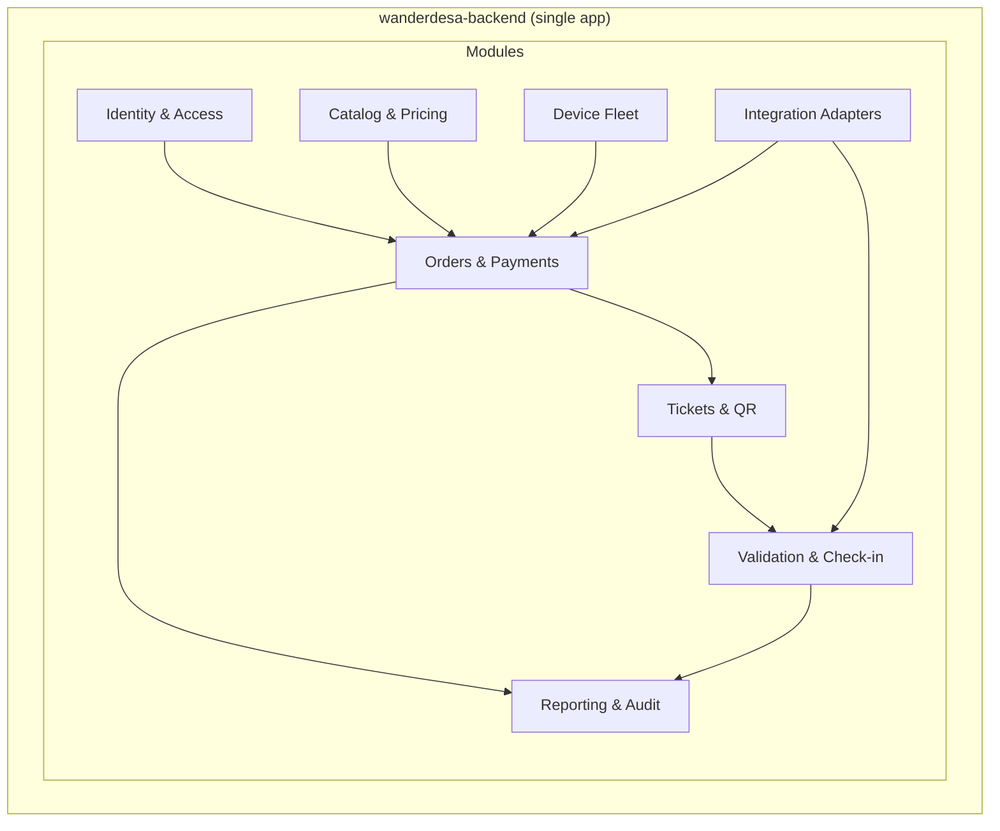

### Backend layering

1. **HTTP / Livewire** — auth middleware, request shaping, response mapping  
2. **Application Actions** — use-case orchestration, transactions boundaries  
3. **Domain Services** — invariants, state transitions, calculations  
4. **Persistence** — Eloquent repositories/models, MySQL constraints  
5. **Integrations** — payment gateway, gate, optional AI ingest  

---

## 6. Kiosk Architecture

Flutter is a **physical self-service terminal client**.

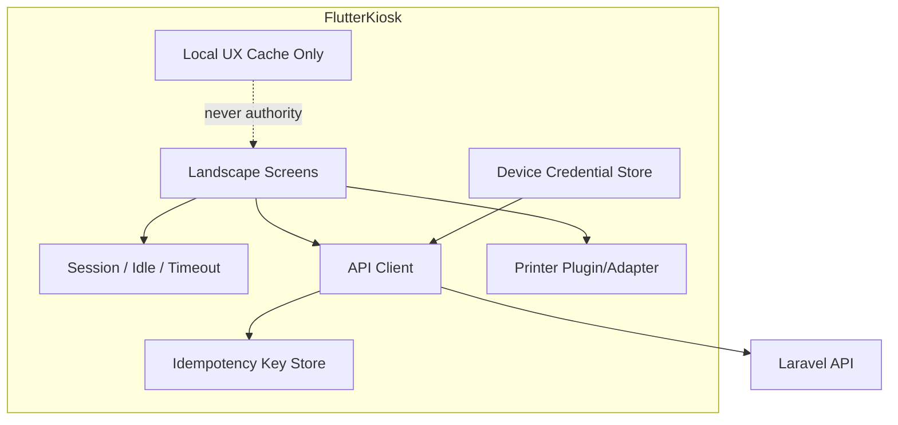

| Allowed locally | Forbidden locally |
|---|---|
| UI state, retry keys, draft selections | Declaring PAID / ISSUED / USED |
| Display of last server response | Independent price authority |
| Printer trigger after server ISSUED | Gate open without server check-in |

---

## 7. Dashboard Architecture

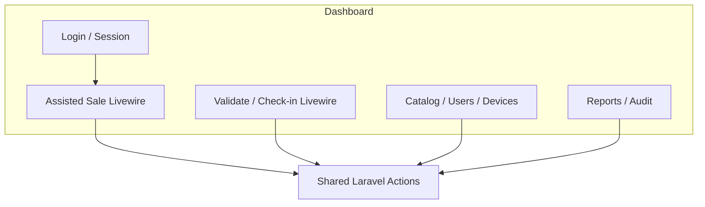

Dashboard is an **operational client**, including POS-like assisted sales — not CRUD-only admin.

---

## 8. Module Architecture

Logical modules inside the monolith (folders/namespaces — not separate services):

| Module | Owns |
|---|---|
| Identity & Access | Users, roles, permissions, staff sessions |
| Catalog & Pricing | Destinations, ticket types, price rules, quotes |
| Commerce | Orders, payments, refunds, idempotency |
| Ticketing | Ticket lifecycle, QR payload issuance |
| Access Control | Validation, check-in, deny codes |
| Device Fleet | Registration, activation, heartbeat, maintenance |
| Reporting | Sales, payment, ticket usage queries |
| Audit | Append-only business audit events |
| Integrations | Payment, printer payload, gate, AI ingest adapters |

Cross-module rule: **Commerce and Ticketing share transactional boundaries** for pay→issue; **Access** depends on Ticketing but does not redefine payment rules.

---

## 9. Domain Boundaries

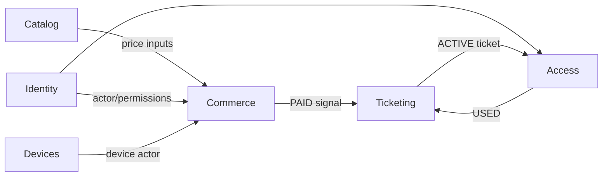

### Bounded contexts (logical, same DB)

| Context | Invariants |
|---|---|
| Catalog | Inactive types not sellable; server price truth |
| Commerce | Idempotent orders/payments; PAID only after verification |
| Ticketing | No ISSUED without PAID; unique codes |
| Access | Single-entry check-in; transactional USED |
| Devices | Disabled/maintenance cannot sell |
| Identity | Server-side authorization |

**Non-boundary:** Do not split “Kiosk Commerce” vs “Dashboard Commerce.”

---

## 10. Data Flow

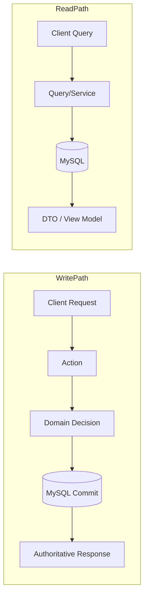

Money and ticket **write paths** always commit in MySQL before clients show success.

---

## 11. Request Lifecycle

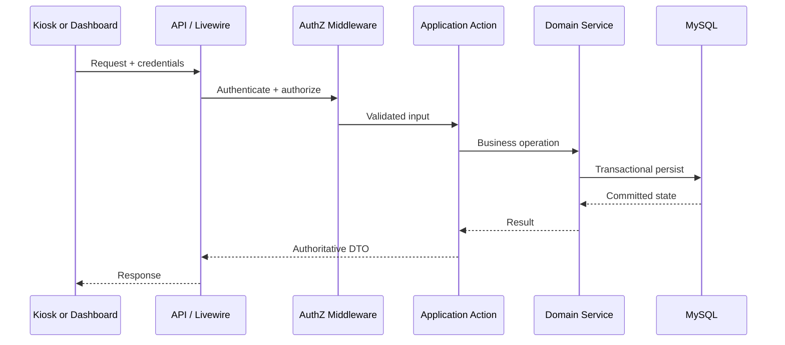

---

## 12. Kiosk Request Flow

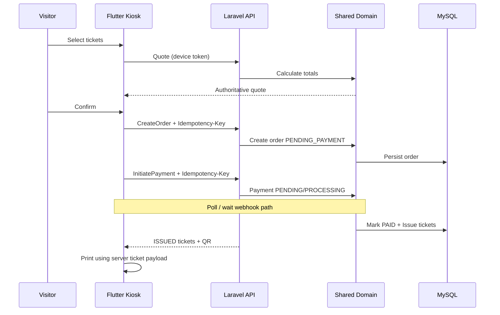

---

## 13. Dashboard Request Flow

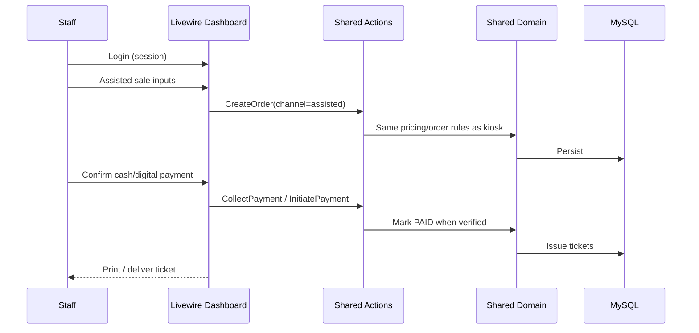

**Same actions/domain as kiosk**; only actor, channel metadata, and UX differ.

---

## 14. Authentication Flow

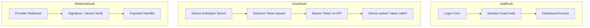

| Client | Auth |
|---|---|
| Dashboard | Session cookie + CSRF |
| Kiosk | Sanctum device token |
| Webhooks | Provider authenticity, not user login |

---

## 15. Authorization Flow

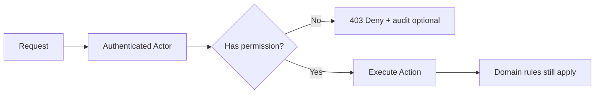

- Permissions checked **server-side** (policies/gates).  
- Device tokens: least privilege (quote/order/pay/heartbeat only).  
- UI menu hiding is non-authoritative.

---

## 16. Order Flow

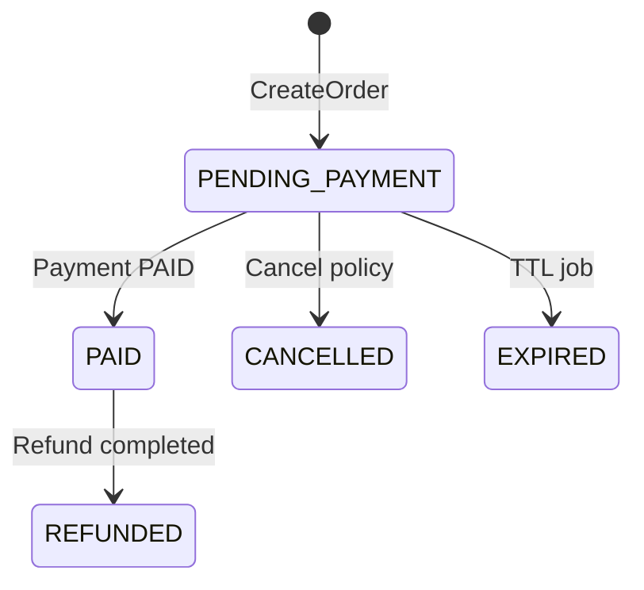

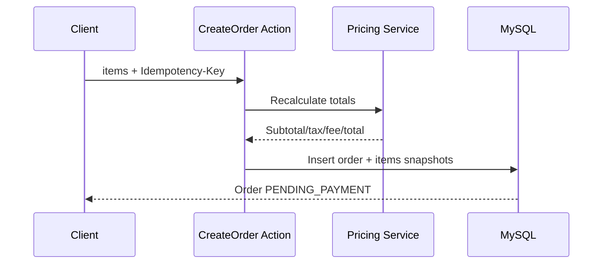

---

## 17. Payment Flow

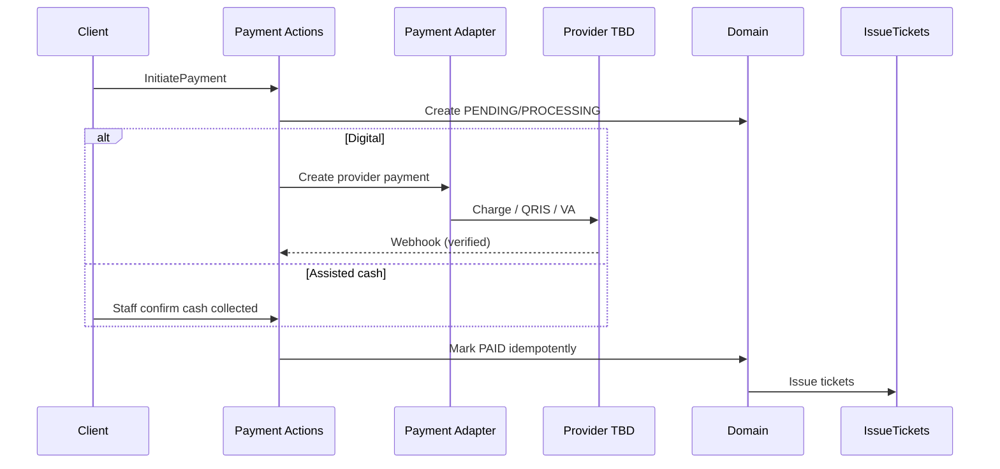

**Invariant:** Client cannot force `PAID`. Duplicate webhooks do not double-charge or double-issue.

---

## 18. Ticket Issuance Flow

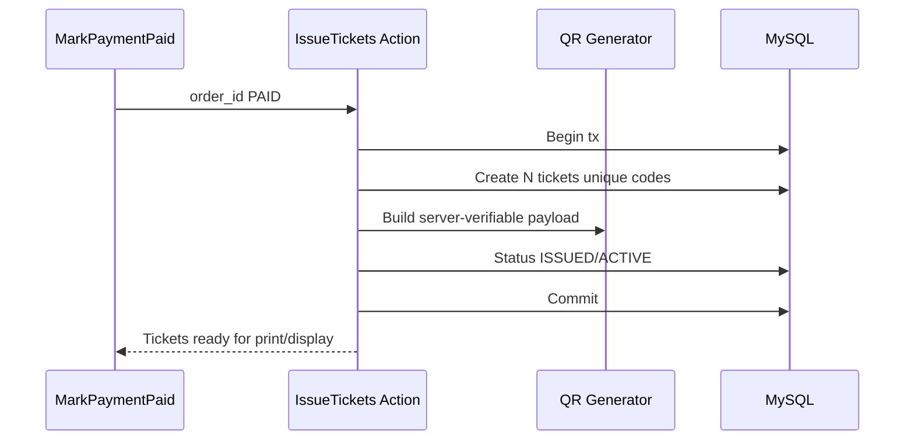

Reprint uses existing ticket records; does not mint a second active ticket by default.

---

## 19. QR Validation Flow

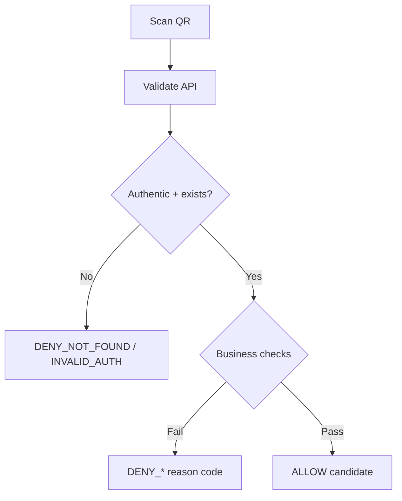

Business checks: destination context, payment valid, ACTIVE, not expired/cancelled/refunded, not used, actor authorized, replay considerations.

---

## 20. Check-in Flow

```mermaid
sequenceDiagram
  participant G as Gate/Staff Client
  participant CI as CheckInTicket Action
  participant DB as MySQL

  G->>CI: ticket payload + context
  CI->>DB: BEGIN + lock ticket row
  CI->>CI: Re-validate eligibility
  alt Eligible
    CI->>DB: Insert check_in
    CI->>DB: ticket ACTIVE → USED
    CI->>DB: COMMIT
    CI-->>G: ALLOW
  else Not eligible
    CI->>DB: ROLLBACK
    CI-->>G: DENY_code
  end
```

Concurrency: exactly one success for MVP single-entry tickets.

---

## 21. Gate Flow

```mermaid
sequenceDiagram
  participant SC as Scanner
  participant APP as Laravel Check-in
  participant GT as Gate Controller Optional

  SC->>APP: Validate + Check-in
  alt ALLOW committed
    APP-->>GT: Open command
    GT-->>SC: Gate opens
  else DENY
    APP-->>SC: Deny reason
    Note over GT: No open command
  end
```

**Forbidden:** Scanner → Flutter → Gate open without Laravel authority.  
Offline gate strategy: out of MVP until explicitly designed.

---

## 22. Device Registration Flow

```mermaid
sequenceDiagram
  participant Admin as Admin/SysAdmin
  participant UI as Dashboard
  participant Dev as Device Module
  participant DB as MySQL
  participant K as Kiosk App

  Admin->>UI: Register device + location
  UI->>Dev: RegisterDevice
  Dev->>DB: status=REGISTERED
  Admin->>UI: Activate / issue secret
  UI->>Dev: ActivateDevice
  Dev->>DB: ACTIVE + credential material
  K->>Dev: Activation exchange
  Dev-->>K: Sanctum token
```

---

## 23. Device Heartbeat Flow

```mermaid
sequenceDiagram
  participant K as Kiosk
  participant API as Heartbeat Endpoint
  participant DB as MySQL
  participant Ops as Ops Dashboard

  loop every <= 60s
    K->>API: heartbeat + software_version + health
    API->>DB: update last_heartbeat, versions, status signals
  end
  Ops->>DB: read fleet
  Note over Ops: stale heartbeat => OFFLINE view
```

Maintenance/remote disable flips flags checked on every commerce request.

---

## 24. Offline Recovery Flow

```mermaid
flowchart TB
  LOSS[Connectivity loss] --> BLOCK[Block new local success claims]
  BLOCK --> WAIT[Show offline / pending UX]
  WAIT --> RETRY[Retry safe APIs with same Idempotency-Key]
  RETRY --> POLL[Poll payment/order status]
  POLL --> JOB[Reconciliation scheduled job]
  JOB --> RESOLVE{Provider says PAID?}
  RESOLVE -->|Yes| ISSUE[Issue tickets if missing]
  RESOLVE -->|No terminal| KEEP[Remain PENDING/FAILED/EXPIRED]
```

Local cache ≠ authoritative transaction state.

---

## 25. Printer Flow

```mermaid
sequenceDiagram
  participant C as Kiosk/Dashboard
  participant API as Laravel
  participant P as Printer Adapter Local

  C->>API: Ensure tickets ISSUED
  API-->>C: Ticket print DTO (code, QR, validity, destination)
  C->>P: Print
  alt Print OK
    P-->>C: Success UX
  else Print fail
    P-->>C: Degraded UX + staff reprint path
    Note over API: Tickets remain ISSUED
  end
```

Print failure never rolls back PAID/ISSUED.

---

## 26. Scanner Flow

```mermaid
sequenceDiagram
  participant HW as Scanner Hardware
  participant UI as Gate UI / Desk Client
  participant API as Laravel Validate/Check-in

  HW->>UI: Raw QR payload
  UI->>API: validate/check-in request + actor context
  API-->>UI: ALLOW or DENY_code
  UI-->>HW: Operator feedback
```

Scanner is an input peripheral; decision remains Laravel’s.

---

## 27. Payment Terminal Flow

```mermaid
sequenceDiagram
  participant K as Kiosk
  participant API as Laravel
  participant AD as Payment Adapter
  participant T as Provider Terminal/QRIS TBD

  K->>API: InitiatePayment
  API->>AD: Create payment intent
  AD->>T: Provider session
  T-->>K: Display QR / instructions via API payload
  T-->>API: Webhook/result
  API->>API: Verify + Mark PAID + Issue
  API-->>K: Final state
```

Any EDC/QRIS medium is still finalized by provider verification + Laravel state.

---

## 28. CCTV / AI Integration Flow

```mermaid
flowchart LR
  CAM[CCTV] --> AI[AI Processor]
  AI --> EVT[Detection Event]
  EVT --> API[Laravel Analytics Ingest]
  API --> STORE[(Event Store / tables)]
  STORE --> RPT[Anomaly Compare Reports]
  RPT -.->|read-only compare| TKT[(Tickets / Check-ins)]
```

**Hard rule:** AI must not silently mutate ticket/payment/check-in authority.

---

## 29. Notification Flow

```mermaid
flowchart TB
  E1[Kiosk offline threshold] --> N[Notification Dispatcher]
  E2[Webhook processing failure] --> N
  E3[Optional print failure signal] --> N
  N --> DASH[Dashboard badge / ops inbox]
  N --> MAIL[Optional Email]
  N --> LOG[Structured Log]
```

MVP prioritizes operational alerts over visitor messaging.

---

## 30. Background Jobs

| Job | Trigger | Purpose |
|---|---|---|
| ProcessPaymentWebhook | Queue | Verify + apply provider event |
| ReconcileOpenPayments | Schedule/queue | Sync PENDING/PROCESSING |
| SendOpsNotification | Queue | Email/badge fan-out |
| GenerateExport optional | Queue | Heavy reports |

```mermaid
flowchart LR
  REQ[HTTP] -->|dispatch| Q[(Queue)]
  Q --> W[Worker]
  W --> ACT[Action / Adapter]
  W --> DB[(MySQL)]
```

Check-in authority remains **synchronous** for gate latency and correctness.

---

## 31. Scheduled Tasks

| Schedule | Task |
|---|---|
| Frequent | Expire unpaid orders/payments (TTL) |
| Frequent | Reconcile open digital payments |
| Frequent | Mark offline kiosks from heartbeat SLA |
| Daily/hourly | Expire tickets past validity |
| Daily | Backup orchestration hook / health digest optional |

```mermaid
flowchart TB
  CRON[VPS cron schedule:run] --> SCH[Laravel Scheduler]
  SCH --> J1[ExpirePayments]
  SCH --> J2[ReconcilePayments]
  SCH --> J3[DeviceOfflineDetect]
  SCH --> J4[ExpireTickets]
```

---

## 32. Database Architecture

Single MySQL **8.4.x** system of record.

```mermaid
erDiagram
  USERS ||--o{ MODEL_HAS_ROLES : has
  ROLES ||--o{ ROLE_HAS_PERMISSIONS : grants
  DESTINATIONS ||--o{ TICKET_TYPES : offers
  DESTINATIONS ||--o{ DEVICES : locates
  TICKET_TYPES ||--o{ ORDER_ITEMS : priced_as
  ORDERS ||--o{ ORDER_ITEMS : contains
  ORDERS ||--o{ PAYMENTS : settled_by
  ORDERS ||--o{ TICKETS : issues
  TICKETS ||--o| CHECK_INS : consumed_by
  DEVICES ||--o{ ORDERS : may_originate
  USERS ||--o{ ORDERS : may_originate
  USERS ||--o{ AUDIT_LOGS : actor
```

### Design notes

- Unique: ticket codes, idempotency keys, provider payment/event IDs  
- Money standard: project-wide consistent (recommended integer IDR)  
- Snapshots on order items preserve historical price  
- Audit tables append-oriented  

---

## 33. Cache Architecture

```mermaid
flowchart LR
  CAT[Catalog reads] --> CACHE[(Cache file/DB/Redis later)]
  CACHE --> APP[App]
  PAY[Payment/Ticket finality] --> DB[(MySQL only authority)]
```

| Cache | OK |
|---|---|
| Catalog listings, config | Yes, with invalidation on admin change |
| PAID/ISSUED/USED as sole source | **No** |

MVP: file/database cache driver acceptable.

---

## 34. Queue Architecture

```mermaid
flowchart TB
  PROD[Producers: HTTP/Webhooks/Schedule] --> DRV[(Queue Driver)]
  DRV --> WORK[queue:work supervised]
  WORK --> OK[Success]
  WORK --> FAIL[(failed_jobs)]
```

MVP driver: **database**. Redis when metrics justify. Workers via Supervisor/systemd on VPS.

---

## 35. Logging Architecture

```mermaid
flowchart LR
  APP[Laravel App] --> CH[Log Channels]
  CH --> FILE[VPS log files]
  REQ[Request] --> CID[Correlation IDs<br/>order/payment/ticket]
  CID --> CH
```

Log: webhook outcomes, auth failures, device disable, job failures.  
Do not log secrets, raw credentials, or full sensitive payloads.

---

## 36. Audit Architecture

```mermaid
flowchart TB
  ACT[Critical Domain Action] --> AW[Audit Writer]
  AW --> AL[(audit_logs)]
  AL --> VIEW[Auditor Dashboard Read API]
```

Audit is **business evidence**, separate from ephemeral technical logs. No user edit UI.

---

## 37. Security Boundaries

```mermaid
flowchart TB
  subgraph PublicZone
    Kiosk[Kiosk App]
  end

  subgraph StaffZone
    Dash[Dashboard Browser]
  end

  subgraph TrustZone["VPS Trust Zone"]
    API[Laravel Authority]
    DB[(MySQL)]
  end

  subgraph External
    PAY[Payment Provider]
    AI[CCTV/AI]
  end

  Kiosk -->|TLS + Device Token| API
  Dash -->|TLS + Session| API
  PAY -->|Signed Webhook| API
  AI -->|Event ingest only| API
  API --> DB
```

| Boundary | Control |
|---|---|
| Public kiosk | Least-privilege token, remote disable, locked OS mode |
| Staff | RBAC + CSRF + session timeout |
| Webhooks | Signature verification + idempotency |
| Data | Minimal PII; hashed secrets |
| Gate | Open only after check-in commit |

---

## 38. Deployment Architecture

```mermaid
flowchart TB
  subgraph DestinationSite
    K1[Kiosk Tablet]
    Desk[Staff Desk + Scanner/Printer]
  end

  subgraph VPS
    NGX[Nginx/Apache + TLS]
    PHP[PHP-FPM Laravel]
    WRK[Queue Worker]
    CRON[Scheduler Cron]
    DB[(MySQL 8.4)]
    BAK[Backup Jobs]
  end

  K1 -->|Internet/VPN HTTPS| NGX
  Desk -->|HTTPS| NGX
  NGX --> PHP
  PHP --> DB
  WRK --> DB
  CRON --> PHP
  BAK --> DB
```

Single VPS modular monolith for MVP. Exact OS/panel: TBD at provisioning.

---

## 39. Scalability

```mermaid
flowchart LR
  MVP[Single destination<br/>vertical VPS] --> NEXT[Redis queue/cache]
  NEXT --> MULTI[Multi-destination packaging]
  MULTI -.->|only if justified| SPLIT[Extract read-heavy reporting]
```

| Phase | Scale move |
|---|---|
| MVP | Vertical VPS, DB queue/cache |
| Growth | Redis, read replicas if needed |
| Later | Module extraction only with measured pain |

**Default:** do not introduce microservices.

---

## 40. Disaster Recovery

| Concern | Approach |
|---|---|
| DB loss | Daily automated MySQL backups + periodic restore test |
| VPS failure | Rebuild from image/IaC notes + restore DB; DNS/TLS reattach |
| Bad deploy | Maintenance mode + rollback release + migrate strategy |
| Payment ambiguity | Reconciliation jobs + provider dashboard cross-check |
| Kiosk fleet outage | Assisted-service channel continues via dashboard |
| Ransomware/secrets | Off-box backup of `.env`/credentials; rotate Sanctum/device secrets |

```mermaid
flowchart TB
  INCIDENT --> ASSESS{Data or App?}
  ASSESS -->|App| ROLL[Rollback release]
  ASSESS -->|Data| REST[Restore MySQL backup]
  REST --> RECON[Reconcile payments/tickets]
  ROLL --> VERIFY[Run critical flow checks]
  RECON --> VERIFY
```

---

## 41. Architecture Decisions

| ID | Decision | Status |
|---|---|---|
| AD-01 | Modular monolith on Laravel 13.x | Accepted |
| AD-02 | Shared application actions for kiosk + dashboard | Accepted |
| AD-03 | Flutter as physical kiosk client only | Accepted |
| AD-04 | No Staff Flutter app in MVP | Accepted |
| AD-05 | Session auth dashboard + Sanctum device API | Accepted |
| AD-06 | MySQL single system of record | Accepted |
| AD-07 | Idempotency keys on critical POSTs | Accepted |
| AD-08 | Synchronous transactional check-in | Accepted |
| AD-09 | Payment/hardware behind adapters | Accepted |
| AD-10 | Database queue/cache acceptable MVP | Accepted |
| AD-11 | Gate & CCTV/AI optional, non-blocking MVP | Accepted |
| AD-12 | No microservices initially | Accepted |
| AD-13 | AI cannot mutate ticket authority | Accepted |
| AD-14 | Offline authoritative selling rejected for MVP | Accepted |

---

## 42. Architecture Trade-Offs

| Choice | Benefit | Cost / Risk | Mitigation |
|---|---|---|---|
| Modular monolith | Simple deploy, shared rules, fast MVP | Single app blast radius | Modules + tests + backups |
| Shared domain for both channels | Zero split-brain pricing/tickets | Requires discipline in UI layers | Thin Livewire/API; action reuse reviews |
| Sync check-in | Strong correctness at gate | Higher request coupling to DB | Indexes + short transactions |
| Async payment webhooks | Provider-friendly | Temporary PENDING ambiguity | Poll + reconcile jobs |
| DB queue/cache on VPS | Low ops complexity | Limited throughput | Move to Redis when measured |
| Local printer on device | Works with tablet topology | Print success ≠ business success | Clear UX + audited reprint |
| No offline sell | Protects ledger integrity | Kiosk unusable when offline | Assisted channel + retry UX |
| Defer microservices | Avoid distributed complexity | Future scale limits | Vertical scale first; extract later only if needed |
| Defer staff mobile app | Focus MVP | Field outdoor scanning limited | Dashboard first; reconsider with evidence |
| Optional gate | Faster MVP | Manual barrier ops initially | Add adapter after check-in proven |

---

## Appendix A — Anti-Patterns Explicitly Rejected

1. Separate “Kiosk pricing engine” and “Dashboard pricing engine”  
2. Flutter declaring payment success from local storage  
3. Livewire computing final totals without server action  
4. Scanner → local allow → gate open  
5. Microservice per module for team aesthetics  
6. CCTV auto-void/auto-check-in tickets  
7. Dual databases for channels  

---

## Appendix B — Channel Convergence Map

| Concern | Kiosk | Dashboard | Shared owner |
|---|---|---|---|
| Quote | REST | Livewire | Pricing Service |
| Create order | REST | Livewire | CreateOrder |
| Pay | REST + webhook | Cash/digital actions | Payment domain |
| Issue ticket | after PAID | after PAID | IssueTickets |
| Validate/Check-in | API from gate clients | Livewire | Access domain |
| AuthZ | Device abilities | RBAC permissions | Identity module |

---

## Appendix C — Suggested Next Documents

1. `05-DATABASE-DESIGN.md` — physical schema  
2. `06-API-DESIGN.md` — endpoint contracts  
3. `07-DOMAIN-MODEL.md` — entities & invariants detail  
4. `08-SEQUENCE-CATALOG.md` — edge cases  

---

*End of system design. No application implementation code in this document.*
