# WanderDesa — Business Flow Document

**Document ID:** `05-BUSINESS-FLOW`  
**File:** `docs/05-BUSINESS-FLOW.md`  
**Status:** Business workflow specification  
**Based on:** `docs/02-PRD.md`, `docs/03-SRS.md`, `docs/04-SYSTEM-DESIGN.md`  
**Code in this phase:** **None**

---

## 0. How to read this document

Each workflow uses the same structure:

| Section | Meaning |
|---|---|
| Trigger | What starts the flow |
| Actor | Who/what performs it |
| Preconditions | Required true conditions |
| Main Flow | Happy path steps |
| Alternative Flow | Valid variations |
| Error Flow | Failures and handling |
| Business Rules | Enforceable rules |
| Database State Changes | Authoritative state impact |
| Notifications | Ops/user signals |
| Audit Events | Must-log business events |
| Final State | End condition |

**Authority rule:** Laravel is the Single Source of Truth. Flutter Kiosk and Dashboard only request; they do not invent money/ticket/check-in finality.

**Channels:**

| Channel | Client | Same business layer? |
|---|---|---|
| Self-service | Flutter physical kiosk | Yes |
| Assisted-service | Blade + Livewire dashboard | Yes |

---

## 0.1 Canonical status machines (normative)

### Order

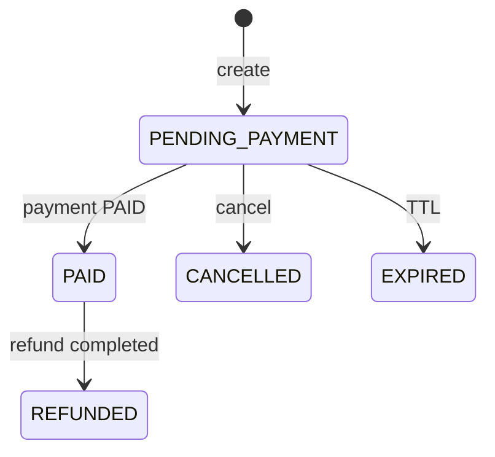
```mermaid
stateDiagram-v2
  [*] --> PENDING_PAYMENT: create
  PENDING_PAYMENT --> PAID: payment PAID
  PENDING_PAYMENT --> CANCELLED: cancel
  PENDING_PAYMENT --> EXPIRED: TTL
  PAID --> REFUNDED: refund completed
```

| From | To | Valid? |
|---|---|---|
| PENDING_PAYMENT | PAID | Yes |
| PENDING_PAYMENT | CANCELLED | Yes |
| PENDING_PAYMENT | EXPIRED | Yes |
| PAID | REFUNDED | Yes |
| EXPIRED/CANCELLED/REFUNDED | PAID | **No** (new order/payment required) |

### Payment

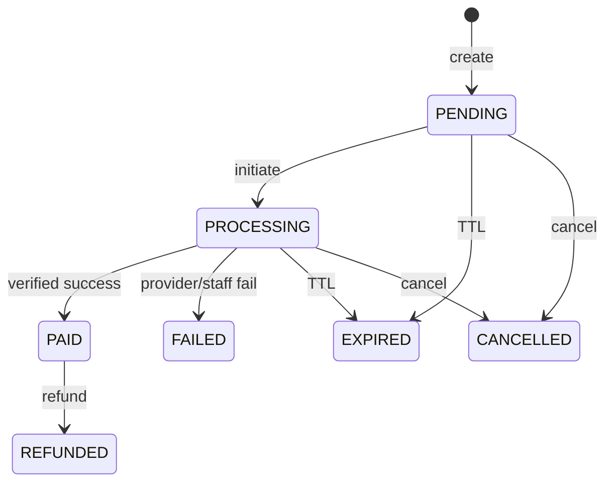
```mermaid
stateDiagram-v2
  [*] --> PENDING: create
  PENDING --> PROCESSING: initiate
  PROCESSING --> PAID: verified success
  PROCESSING --> FAILED: provider/staff fail
  PENDING --> EXPIRED: TTL
  PROCESSING --> EXPIRED: TTL
  PENDING --> CANCELLED: cancel
  PROCESSING --> CANCELLED: cancel
  PAID --> REFUNDED: refund
```

| From | To | Valid? |
|---|---|---|
| — | PENDING | Yes |
| PENDING | PROCESSING | Yes |
| PROCESSING | PAID / FAILED | Yes |
| PENDING/PROCESSING | EXPIRED / CANCELLED | Yes |
| PAID | REFUNDED | Yes |
| FAILED/EXPIRED/CANCELLED/REFUNDED | PAID | **No** (new payment record) |

### Ticket

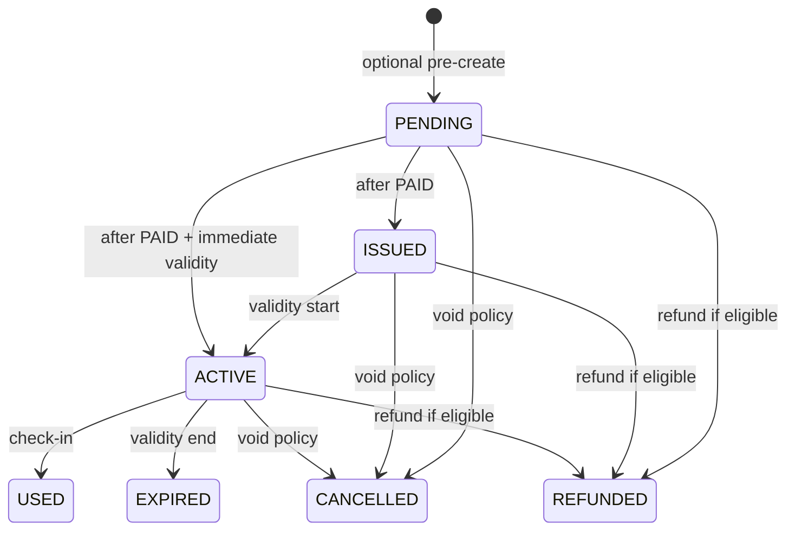
```mermaid
stateDiagram-v2
  [*] --> PENDING: optional pre-create
  PENDING --> ISSUED: after PAID
  PENDING --> ACTIVE: after PAID + immediate validity
  ISSUED --> ACTIVE: validity start
  ACTIVE --> USED: check-in
  ACTIVE --> EXPIRED: validity end
  ACTIVE --> CANCELLED: void policy
  ISSUED --> CANCELLED: void policy
  PENDING --> CANCELLED: void policy
  ACTIVE --> REFUNDED: refund if eligible
  ISSUED --> REFUNDED: refund if eligible
  PENDING --> REFUNDED: refund if eligible
```

**MVP defaults:**

- Issue only after payment `PAID`
- Single-entry: `ACTIVE → USED` once
- Refund allowed only if ticket not `USED` (override only with elevated audited permission if enabled later)

### Device

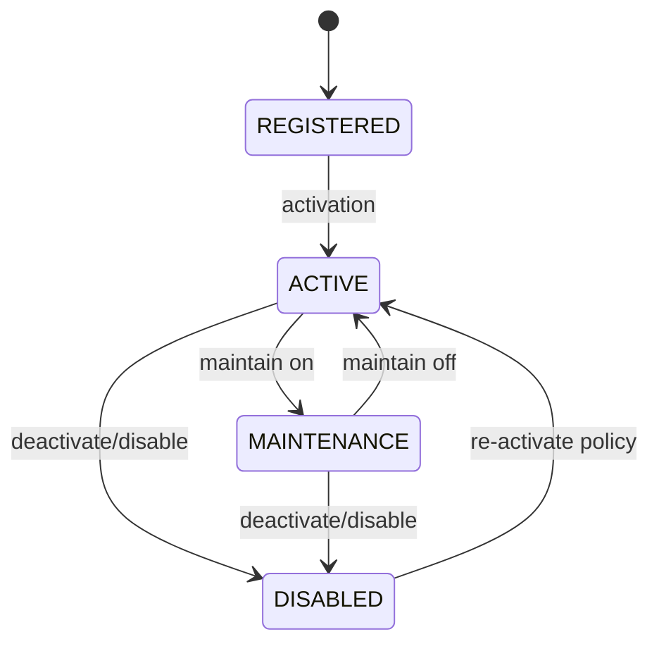
```mermaid
stateDiagram-v2
  [*] --> REGISTERED
  REGISTERED --> ACTIVE: activation
  ACTIVE --> MAINTENANCE: maintain on
  MAINTENANCE --> ACTIVE: maintain off
  ACTIVE --> DISABLED: deactivate/disable
  MAINTENANCE --> DISABLED: deactivate/disable
  DISABLED --> ACTIVE: re-activate policy
```

`OFFLINE` is a **derived operational view** from stale heartbeat, not necessarily a persisted exclusive status.

### Check-in result codes

`ALLOW`, `DENY_NOT_FOUND`, `DENY_INVALID_AUTH`, `DENY_WRONG_DESTINATION`, `DENY_NOT_PAID`, `DENY_NOT_ACTIVE`, `DENY_EXPIRED`, `DENY_CANCELLED`, `DENY_REFUNDED`, `DENY_ALREADY_USED`, `DENY_UNAUTHORIZED`

---

## 1. Visitor browsing

| Field | Content |
|---|---|
| **Trigger** | Visitor approaches idle kiosk or staff opens assisted catalog |
| **Actor** | Visitor (kiosk) or Ticket Officer (dashboard browse for visitor) |
| **Preconditions** | Kiosk `ACTIVE` and not maintenance (self-service); or staff authenticated (assisted). Destination/catalog published. |
| **Main Flow** | 1) Client requests catalog/quote context from Laravel 2) Laravel returns active destinations/ticket types 3) UI displays browse list |
| **Alternative Flow** | Single-destination mode skips destination pick; language toggle ID/(optional EN) |
| **Error Flow** | API unreachable → offline/unavailable screen; empty catalog → “tiket tidak tersedia” |
| **Business Rules** | Inactive ticket types hidden; prices shown are server quotes only |
| **Database State Changes** | Read-only (optional session analytics event later) |
| **Notifications** | None |
| **Audit Events** | None required for anonymous browse |
| **Final State** | Catalog visible; no order created |

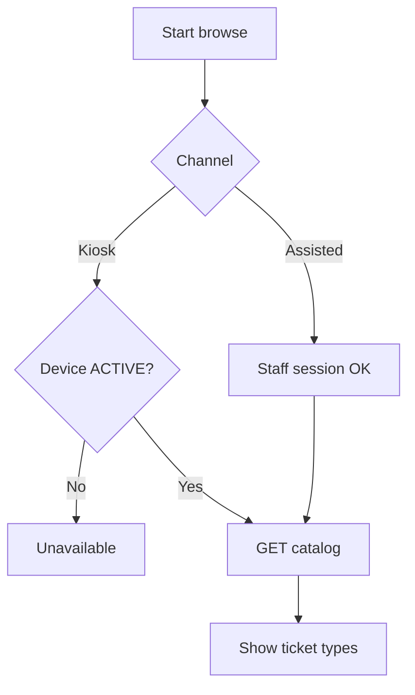
```mermaid
flowchart TD
  A[Start browse] --> B{Channel}
  B -->|Kiosk| C{Device ACTIVE?}
  C -->|No| X[Unavailable]
  C -->|Yes| D[GET catalog]
  B -->|Assisted| E[Staff session OK]
  E --> D
  D --> F[Show ticket types]
```

---

## 2. Ticket selection

| Field | Content |
|---|---|
| **Trigger** | Visitor/staff selects ticket type and quantity |
| **Actor** | Visitor or Ticket Officer |
| **Preconditions** | Ticket type active; quantity ≥ 1; within configured max per order |
| **Main Flow** | 1) Select type/qty/visit date if required 2) Request authoritative quote 3) Display subtotal, tax, fee, discount, grand total from Laravel |
| **Alternative Flow** | Multi-type cart (if enabled); assisted special notes field (non-price) |
| **Error Flow** | Stale/inactive type → refresh catalog; qty over max → validation error |
| **Business Rules** | Client cannot override unit price/total; Laravel recalculates |
| **Database State Changes** | None (quote may be ephemeral) |
| **Notifications** | None |
| **Audit Events** | None |
| **Final State** | Selection ready for order confirm |

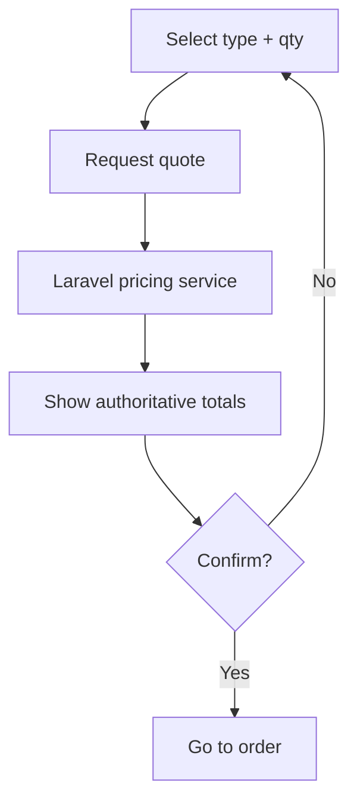
```mermaid
flowchart TD
  S[Select type + qty] --> Q[Request quote]
  Q --> R[Laravel pricing service]
  R --> U[Show authoritative totals]
  U --> C{Confirm?}
  C -->|Yes| O[Go to order]
  C -->|No| S
```

---

## 3. Self-service order

| Field | Content |
|---|---|
| **Trigger** | Visitor confirms order on kiosk |
| **Actor** | Visitor + Kiosk device credential |
| **Preconditions** | Device `ACTIVE`, not maintenance; valid selection; Idempotency-Key present |
| **Main Flow** | 1) POST create order with channel=`kiosk` 2) Laravel recalculates totals 3) Persist order `PENDING_PAYMENT` + items snapshots 4) Return order id |
| **Alternative Flow** | Retry with same Idempotency-Key returns same order |
| **Error Flow** | Device disabled → reject; validation fail → 422; conflict idempotency payload → 409 |
| **Business Rules** | Same CreateOrder action as assisted; no client money authority; channel immutable |
| **Database State Changes** | `orders` + `order_items` inserted; idempotency record stored |
| **Notifications** | None |
| **Audit Events** | `order.created` (device actor) |
| **Final State** | Order `PENDING_PAYMENT` |

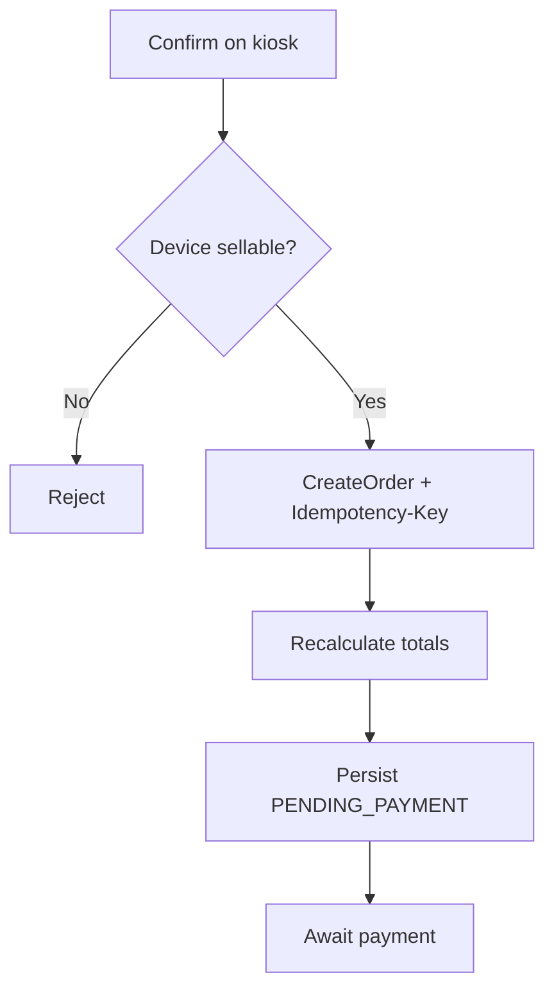
```mermaid
flowchart TD
  A[Confirm on kiosk] --> B{Device sellable?}
  B -->|No| X[Reject]
  B -->|Yes| C[CreateOrder + Idempotency-Key]
  C --> D[Recalculate totals]
  D --> E[Persist PENDING_PAYMENT]
  E --> F[Await payment]
```

---

## 4. Assisted-service order

| Field | Content |
|---|---|
| **Trigger** | Ticket Officer confirms assisted sale cart |
| **Actor** | Ticket Officer (staff user) |
| **Preconditions** | Staff authenticated; permission `orders.create`; ticket types active |
| **Main Flow** | 1) Dashboard submits CreateOrder channel=`assisted` 2) Same pricing/order domain as kiosk 3) Order `PENDING_PAYMENT` 4) Proceed to payment collection UI |
| **Alternative Flow** | Officer edits qty before confirm; cancel before payment |
| **Error Flow** | Unauthorized → 403; inactive catalog → error |
| **Business Rules** | **No separate business logic** from kiosk; only actor/channel metadata differ |
| **Database State Changes** | Order/items created; `created_by_user_id` set |
| **Notifications** | None |
| **Audit Events** | `order.created` (staff actor) |
| **Final State** | Order `PENDING_PAYMENT` |

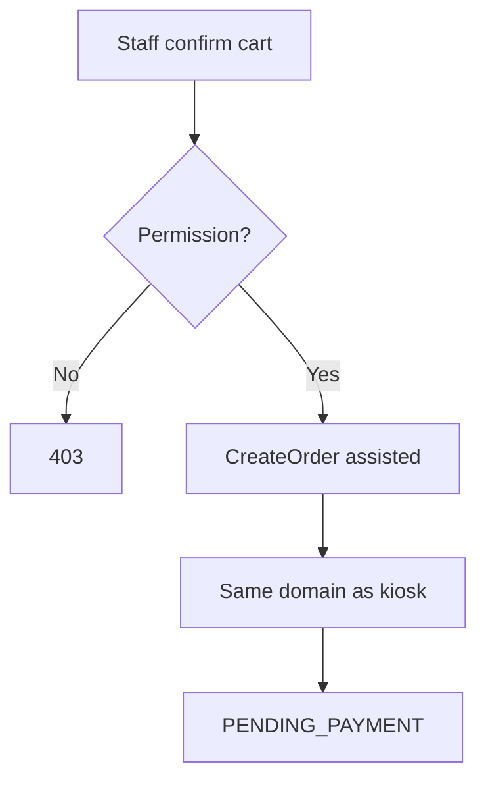
```mermaid
flowchart TD
  A[Staff confirm cart] --> B{Permission?}
  B -->|No| X[403]
  B -->|Yes| C[CreateOrder assisted]
  C --> D[Same domain as kiosk]
  D --> E[PENDING_PAYMENT]
```

---

## 5. Payment

| Field | Content |
|---|---|
| **Trigger** | Order exists and actor starts payment |
| **Actor** | Kiosk device (digital) or Ticket Officer (cash/digital) |
| **Preconditions** | Order `PENDING_PAYMENT`; amount = authoritative order total; permission/device ability |
| **Main Flow** | 1) Create payment `PENDING` 2) Move `PROCESSING` 3) Digital: provider session created / Cash: staff confirmation path started 4) Wait verification |
| **Alternative Flow** | Assisted digital uses same provider adapter; cash skips provider |
| **Error Flow** | Provider initiate fail → `FAILED` or remain retryable per policy; unauthorized cash confirm blocked |
| **Business Rules** | Partial pay not in MVP; idempotent initiate; amount must match order total |
| **Database State Changes** | `payments` row; order remains `PENDING_PAYMENT` until PAID |
| **Notifications** | Optional ops alert on repeated initiate failures |
| **Audit Events** | `payment.initiated` |
| **Final State** | Payment `PROCESSING` (or terminal fail) |

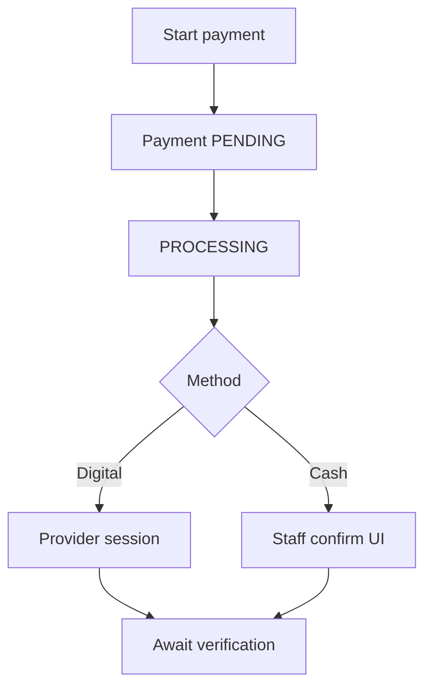
```mermaid
flowchart TD
  A[Start payment] --> B[Payment PENDING]
  B --> C[PROCESSING]
  C --> D{Method}
  D -->|Digital| E[Provider session]
  D -->|Cash| F[Staff confirm UI]
  E --> G[Await verification]
  F --> G
```

---

## 6. Payment verification

| Field | Content |
|---|---|
| **Trigger** | Provider webhook/callback, status poll reconciliation, or staff cash confirm |
| **Actor** | System (webhook/job) or authorized staff (cash) |
| **Preconditions** | Payment `PENDING`/`PROCESSING`; webhook signature valid (digital); staff has `payments.collect.cash` (cash) |
| **Main Flow** | 1) Verify authenticity 2) Idempotent apply provider event 3) Transition payment → `PAID` 4) Transition order → `PAID` 5) Trigger ticket issuance |
| **Alternative Flow** | Duplicate webhook acknowledged with no state change; poll finds already PAID |
| **Error Flow** | Invalid signature → reject; provider failed → `FAILED`; timeout TTL → `EXPIRED` |
| **Business Rules** | Never trust client “success”; PAID only after verification; duplicates must not double-issue |
| **Database State Changes** | payment `PAID`; order `PAID`; provider refs stored |
| **Notifications** | Webhook verify failure → ops/log alert |
| **Audit Events** | `payment.paid` |
| **Final State** | Payment `PAID`, Order `PAID`, issuance eligible |

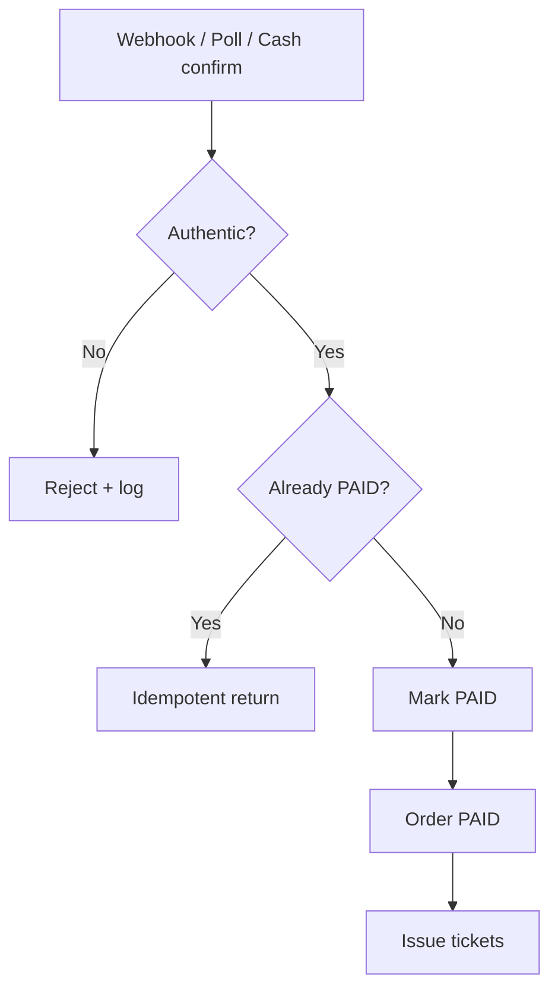
```mermaid
flowchart TD
  T[Webhook / Poll / Cash confirm] --> V{Authentic?}
  V -->|No| R[Reject + log]
  V -->|Yes| I{Already PAID?}
  I -->|Yes| S[Idempotent return]
  I -->|No| P[Mark PAID]
  P --> O[Order PAID]
  O --> X[Issue tickets]
```

---

## 7. Ticket issuance

| Field | Content |
|---|---|
| **Trigger** | Payment reaches `PAID` |
| **Actor** | System (IssueTickets action) |
| **Preconditions** | Order `PAID`; tickets not already issued for order lines; qty > 0 |
| **Main Flow** | 1) Begin DB transaction 2) Create N tickets with unique codes 3) Generate QR payloads 4) Set `ISSUED`/`ACTIVE` per validity 5) Commit |
| **Alternative Flow** | Re-entry after crash: if tickets exist for PAID order, return existing (idempotent issuance) |
| **Error Flow** | Issuance failure after PAID → ops incident; reconcile/retry issue without new payment |
| **Business Rules** | No ISSUED without PAID; channel copied from order; price snapshots retained |
| **Database State Changes** | `tickets` inserted; statuses `ISSUED`/`ACTIVE` |
| **Notifications** | Issuance failure alert to ops |
| **Audit Events** | `ticket.issued` |
| **Final State** | Tickets issued and entry-eligible when `ACTIVE` |

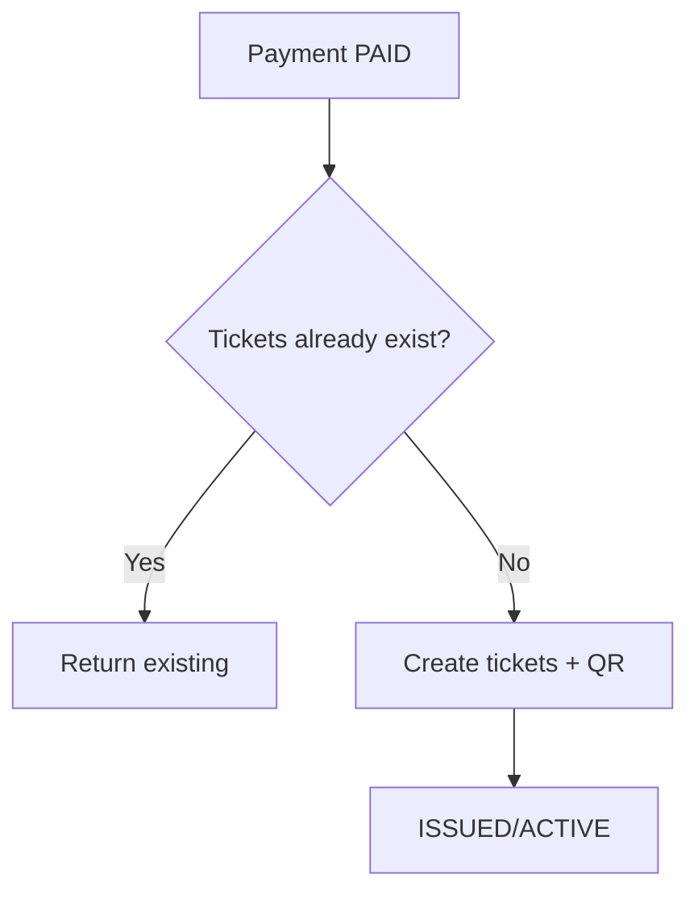
```mermaid
flowchart TD
  A[Payment PAID] --> B{Tickets already exist?}
  B -->|Yes| C[Return existing]
  B -->|No| D[Create tickets + QR]
  D --> E[ISSUED/ACTIVE]
```

---

## 8. Ticket printing

| Field | Content |
|---|---|
| **Trigger** | Tickets `ISSUED`/`ACTIVE` and print requested |
| **Actor** | Kiosk printer path or Ticket Officer reprint/print |
| **Preconditions** | Authoritative ticket payload available; printer configured (type TBD) |
| **Main Flow** | 1) Client fetches print DTO from server tickets 2) Send to printer 3) Show success |
| **Alternative Flow** | On-screen QR fallback if print optional by policy; staff reprint with permission |
| **Error Flow** | See workflow 25 Printer failure |
| **Business Rules** | Print success/failure does not change payment/ticket money state; reprint audited; no second active ticket |
| **Database State Changes** | Optional `printed_at` / print attempt log; ticket status unchanged |
| **Notifications** | Print fail guidance to visitor/staff |
| **Audit Events** | `ticket.printed` / `ticket.reprinted` |
| **Final State** | Physical/on-screen ticket delivered; ledger unchanged aside from print metadata |

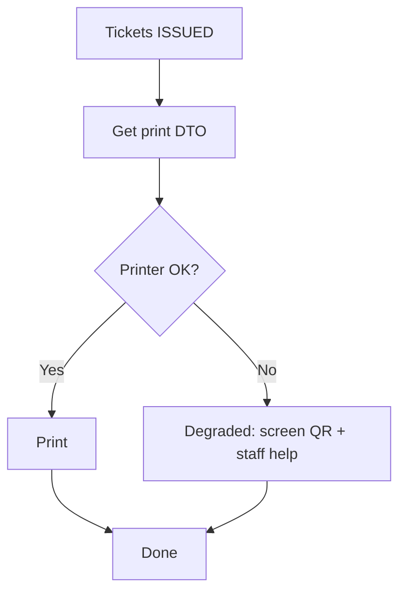
```mermaid
flowchart TD
  A[Tickets ISSUED] --> B[Get print DTO]
  B --> C{Printer OK?}
  C -->|Yes| D[Print]
  C -->|No| E[Degraded: screen QR + staff help]
  D --> F[Done]
  E --> F
```

---

## 9. QR generation

| Field | Content |
|---|---|
| **Trigger** | During ticket issuance |
| **Actor** | System |
| **Preconditions** | Ticket record being created; signing/opaque strategy configured (TBD) |
| **Main Flow** | 1) Build server-verifiable payload bound to ticket id/code 2) Persist necessary verification material 3) Return printable QR content |
| **Alternative Flow** | Regeneration for reprint uses same ticket binding (no new ticket) |
| **Error Flow** | Generator failure aborts issuance transaction |
| **Business Rules** | Payload alone insufficient without server validation; must be authenticable |
| **Database State Changes** | Ticket QR fields/secrets as designed |
| **Notifications** | None |
| **Audit Events** | Covered by `ticket.issued` |
| **Final State** | Each issued ticket has QR payload |

---

## 10. QR scanning

| Field | Content |
|---|---|
| **Trigger** | Gate/counter scanner captures QR |
| **Actor** | Gate Officer / scanner peripheral + dashboard/gate client |
| **Preconditions** | Scanner available; staff/device authorized to validate |
| **Main Flow** | 1) Capture payload 2) Submit to Laravel validate/check-in API 3) Display ALLOW/DENY |
| **Alternative Flow** | Manual code entry if scan fails but code readable |
| **Error Flow** | See workflow 26 Scanner failure |
| **Business Rules** | No local ALLOW decision; scanner is input only |
| **Database State Changes** | None until validation/check-in succeeds |
| **Notifications** | None |
| **Audit Events** | Optional `qr.scan_attempt` (recommended for gate disputes) |
| **Final State** | Payload submitted for validation |

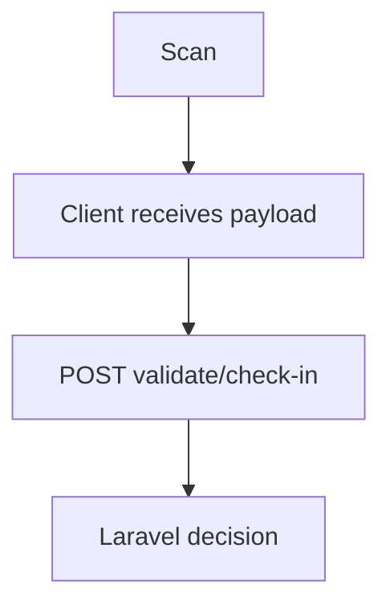
```mermaid
flowchart TD
  A[Scan] --> B[Client receives payload]
  B --> C[POST validate/check-in]
  C --> D[Laravel decision]
```

---

## 11. Ticket validation

| Field | Content |
|---|---|
| **Trigger** | Validate request received |
| **Actor** | System + authorized gate actor |
| **Preconditions** | Authenticated/authorized scanner context |
| **Main Flow** | Laravel checks: exists, authentic, destination, payment valid, status ACTIVE, not expired/cancelled/refunded, not used, actor authorized, replay considerations → return candidate ALLOW or DENY_code |
| **Alternative Flow** | Validate-only mode (no check-in) for inspection |
| **Error Flow** | Unauthorized → `DENY_UNAUTHORIZED`; malformed → deny/invalid |
| **Business Rules** | All checks server-side; stable reason codes |
| **Database State Changes** | Read + optional attempt log; no USED yet if validate-only |
| **Notifications** | None |
| **Audit Events** | `ticket.validated` (result code) |
| **Final State** | ALLOW candidate or DENY |

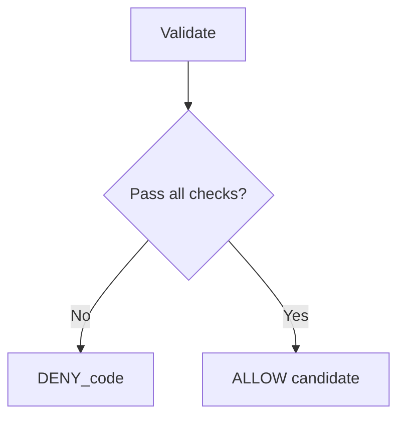
```mermaid
flowchart TD
  A[Validate] --> B{Pass all checks?}
  B -->|No| C[DENY_code]
  B -->|Yes| D[ALLOW candidate]
```

---

## 12. Check-in

| Field | Content |
|---|---|
| **Trigger** | ALLOW candidate proceeds to check-in (often same API) |
| **Actor** | System + Gate Officer context |
| **Preconditions** | Ticket `ACTIVE`; permission `checkin.perform`; single-entry MVP |
| **Main Flow** | 1) Begin tx + lock ticket 2) Re-validate 3) Insert check-in 4) `ACTIVE → USED` 5) Commit 6) Return ALLOW |
| **Alternative Flow** | Combined validate+check-in endpoint for gate speed |
| **Error Flow** | Race lost → `DENY_ALREADY_USED`; rule fail → matching DENY |
| **Business Rules** | Transactional; exactly-once success under concurrency |
| **Database State Changes** | `check_ins` insert; ticket `USED` |
| **Notifications** | None MVP |
| **Audit Events** | `ticket.checked_in` |
| **Final State** | Ticket `USED`; check-in recorded |

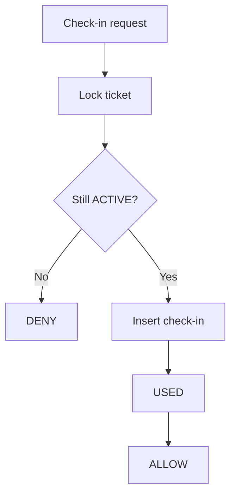
```mermaid
flowchart TD
  A[Check-in request] --> B[Lock ticket]
  B --> C{Still ACTIVE?}
  C -->|No| D[DENY]
  C -->|Yes| E[Insert check-in]
  E --> F[USED]
  F --> G[ALLOW]
```

---

## 13. Gate entry

| Field | Content |
|---|---|
| **Trigger** | Successful check-in `ALLOW` |
| **Actor** | System → optional Gate Controller; Gate Officer for manual barrier |
| **Preconditions** | Check-in committed; gate module enabled if automated |
| **Main Flow** | 1) Check-in success 2) Send open command to gate adapter 3) Visitor enters |
| **Alternative Flow** | Gate module off → staff opens physical barrier on ALLOW UI |
| **Error Flow** | Gate hardware fail after ALLOW → ops issue; ticket already USED (manual exception policy) |
| **Business Rules** | Never open gate without Laravel check-in success; no Flutter-only gate open |
| **Database State Changes** | Optional gate command log; ticket already USED |
| **Notifications** | Gate fault alert to operator |
| **Audit Events** | `gate.open_command` (if automated) |
| **Final State** | Entry granted; ticket consumed |

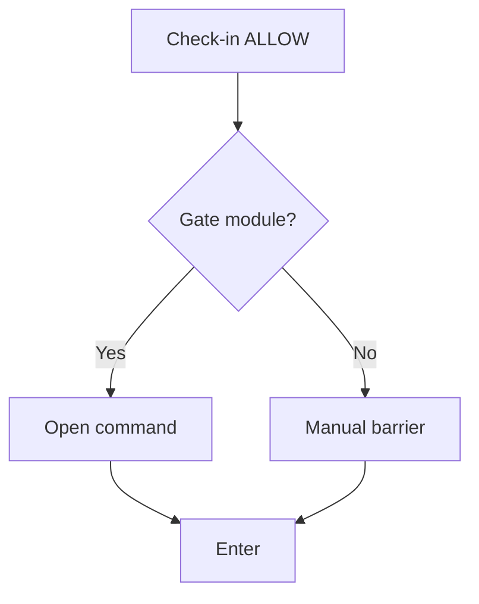
```mermaid
flowchart TD
  A[Check-in ALLOW] --> B{Gate module?}
  B -->|Yes| C[Open command]
  B -->|No| D[Manual barrier]
  C --> E[Enter]
  D --> E
```

---

## 14. Cancellation

| Field | Content |
|---|---|
| **Trigger** | Abandon unpaid order, staff cancel, or system policy cancel |
| **Actor** | Visitor (kiosk abandon), Ticket Officer, System |
| **Preconditions** | Order `PENDING_PAYMENT` and payment not `PAID`; permission for staff cancel |
| **Main Flow** | 1) Cancel payment if exists → `CANCELLED` 2) Order → `CANCELLED` 3) No tickets issued |
| **Alternative Flow** | Kiosk timeout returns idle without explicit cancel (TTL expire may apply instead) |
| **Error Flow** | Cancel after PAID rejected → must use refund flow |
| **Business Rules** | Cannot cancel PAID via cancel; channel rules shared |
| **Database State Changes** | order/payment `CANCELLED` |
| **Notifications** | None typical |
| **Audit Events** | `order.cancelled`, `payment.cancelled` |
| **Final State** | Cancelled unpaid; no tickets |

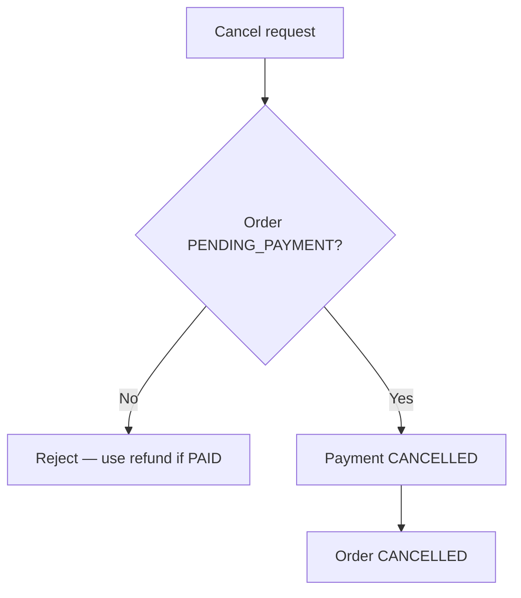
```mermaid
flowchart TD
  A[Cancel request] --> B{Order PENDING_PAYMENT?}
  B -->|No| X[Reject — use refund if PAID]
  B -->|Yes| C[Payment CANCELLED]
  C --> D[Order CANCELLED]
```

---

## 15. Refund

| Field | Content |
|---|---|
| **Trigger** | Finance/Admin initiates refund on PAID order |
| **Actor** | Finance / Admin with `refunds.create` |
| **Preconditions** | Order/Payment `PAID`; MVP: related tickets not `USED` (default); provider refund possible for digital |
| **Main Flow** | 1) Validate eligibility 2) Execute provider refund if digital / record cash refund 3) Payment `REFUNDED` 4) Order `REFUNDED` 5) Tickets → `REFUNDED` 6) Audit |
| **Alternative Flow** | Partial refunds **out of MVP**; elevated override for USED tickets only if explicitly enabled later |
| **Error Flow** | Provider refund fail → keep PAID + incident; ineligible USED → deny |
| **Business Rules** | Permissioned; audited; tickets lose entry eligibility |
| **Database State Changes** | payment/order/tickets `REFUNDED` |
| **Notifications** | Optional finance confirmation |
| **Audit Events** | `refund.created`, `ticket.refunded` |
| **Final State** | Money refunded; tickets not entry-eligible |

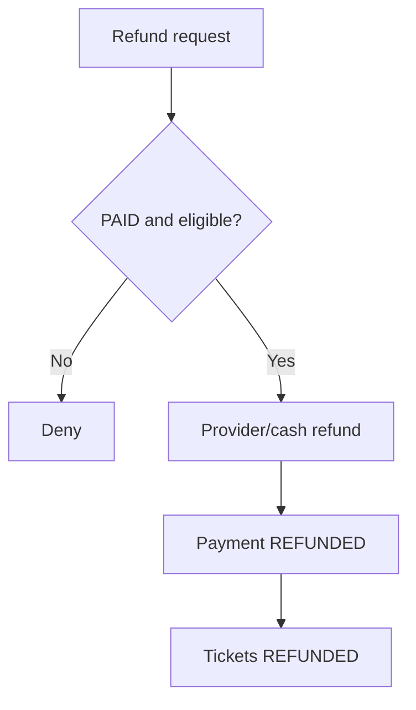
```mermaid
flowchart TD
  A[Refund request] --> B{PAID and eligible?}
  B -->|No| X[Deny]
  B -->|Yes| C[Provider/cash refund]
  C --> D[Payment REFUNDED]
  D --> E[Tickets REFUNDED]
```

---

## 16. Expiration

| Field | Content |
|---|---|
| **Trigger** | Scheduler TTL for unpaid; validity end for tickets |
| **Actor** | System jobs |
| **Preconditions** | Unpaid beyond TTL; or `ACTIVE`/`ISSUED` past validity end unused |
| **Main Flow** | **Payments/Orders:** PENDING/PROCESSING unpaid → payment `EXPIRED`, order `EXPIRED`. **Tickets:** unused past window → `EXPIRED` |
| **Alternative Flow** | On-validate discovery marks expired if job lag |
| **Error Flow** | Job failure → retry; alert if backlog |
| **Business Rules** | Expired unpaid never issues tickets; expired tickets DENY at gate |
| **Database State Changes** | status → `EXPIRED` |
| **Notifications** | Job failure ops alert |
| **Audit Events** | `order.expired`, `payment.expired`, `ticket.expired` |
| **Final State** | Terminal expired states |

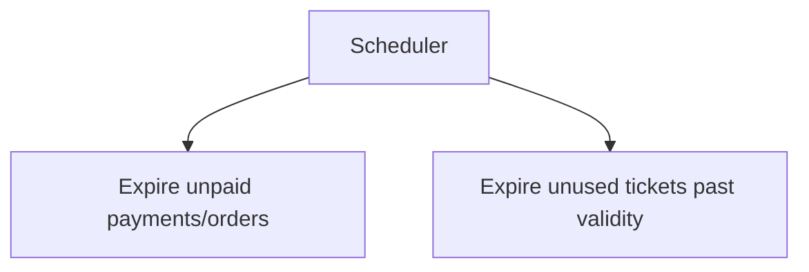
```mermaid
flowchart TD
  J[Scheduler] --> P[Expire unpaid payments/orders]
  J --> T[Expire unused tickets past validity]
```

---

## 17. Ticket reuse prevention

| Field | Content |
|---|---|
| **Trigger** | Presentation of already consumed or void ticket QR |
| **Actor** | System validation |
| **Preconditions** | Ticket exists |
| **Main Flow** | If `USED`/`CANCELLED`/`REFUNDED`/`EXPIRED`/not `ACTIVE` → DENY with specific code |
| **Alternative Flow** | Multi-entry not in MVP |
| **Error Flow** | N/A beyond deny |
| **Business Rules** | MVP single-entry; USED cannot re-enter |
| **Database State Changes** | No change on deny; attempt may log |
| **Notifications** | None |
| **Audit Events** | `ticket.validate_denied` reason `DENY_ALREADY_USED` / others |
| **Final State** | Entry refused; original USED preserved |

---

## 18. Double check-in prevention

| Field | Content |
|---|---|
| **Trigger** | Concurrent or sequential second check-in attempts |
| **Actor** | System |
| **Preconditions** | First check-in may be in-flight or completed |
| **Main Flow** | Row lock + unique check-in rule → first commits USED; second gets `DENY_ALREADY_USED` |
| **Alternative Flow** | Same request idempotency returns original ALLOW if identical in-flight design supports it |
| **Error Flow** | DB conflict handled as deny/ idempotent success |
| **Business Rules** | Exactly one successful check-in per MVP ticket |
| **Database State Changes** | One check-in row; one USED transition |
| **Notifications** | None |
| **Audit Events** | One `ticket.checked_in`; denials logged |
| **Final State** | Single consumption |

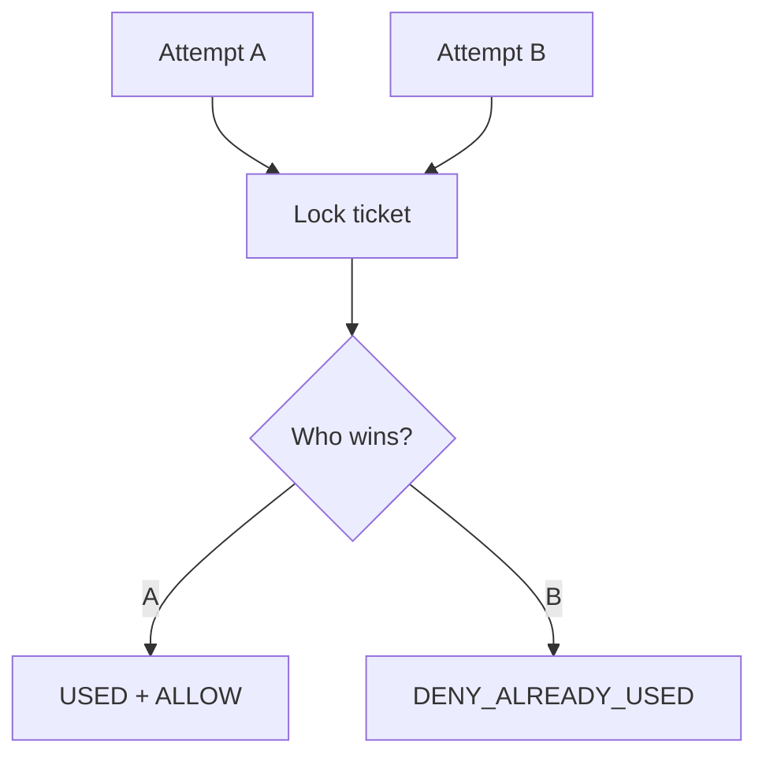
```mermaid
flowchart TD
  A[Attempt A] --> L[Lock ticket]
  B[Attempt B] --> L
  L --> W{Who wins?}
  W -->|A| S[USED + ALLOW]
  W -->|B| D[DENY_ALREADY_USED]
```

---

## 19. Staff-assisted transaction

End-to-end assisted commerce (composes 4→5→6→7→8).

| Field | Content |
|---|---|
| **Trigger** | Visitor needs counter help (cash, confusion, group, accessibility) |
| **Actor** | Ticket Officer + Visitor |
| **Preconditions** | Staff permissions for order + payment; printer optional |
| **Main Flow** | Browse → select → assisted order → collect payment → verify PAID → issue → print/deliver → visitor to gate |
| **Alternative Flow** | Digital assisted pay; reprint; cancel before pay |
| **Error Flow** | Payment fail → new attempt; print fail → screen/code + reprint later |
| **Business Rules** | Same domain services as kiosk; cash PAID audited with staff id |
| **Database State Changes** | Same entities as self-service with channel=`assisted` |
| **Notifications** | None typical |
| **Audit Events** | order/payment/ticket/print events with staff actor |
| **Final State** | Tickets issued; visitor can check in |

```mermaid
flowchart LR
  A[Assisted select] --> B[Order]
  B --> C[Pay]
  C --> D[Verify]
  D --> E[Issue]
  E --> F[Print/Deliver]
```

---

## 20. Kiosk registration

| Field | Content |
|---|---|
| **Trigger** | Admin/SysAdmin adds a new terminal |
| **Actor** | Admin / SysAdmin |
| **Preconditions** | Permission `kiosk.register`; location/destination known |
| **Main Flow** | 1) Enter device identity metadata 2) Persist device `REGISTERED` 3) Await activation |
| **Alternative Flow** | Bulk register later |
| **Error Flow** | Duplicate device_id → reject |
| **Business Rules** | Unregistered devices cannot obtain sell tokens |
| **Database State Changes** | `devices` insert `REGISTERED` |
| **Notifications** | None |
| **Audit Events** | `device.registered` |
| **Final State** | Device registered, not selling |

---

## 21. Kiosk activation

| Field | Content |
|---|---|
| **Trigger** | Admin activates device; kiosk app redeems activation material |
| **Actor** | Admin/SysAdmin + Kiosk app |
| **Preconditions** | Device `REGISTERED` |
| **Main Flow** | 1) Issue activation secret 2) Kiosk exchanges secret → Sanctum token 3) Device `ACTIVE` with `activated_at` |
| **Alternative Flow** | Re-issue activation after wipe |
| **Error Flow** | Invalid/expired activation secret → deny |
| **Business Rules** | Token least privilege; secrets hashed/protected |
| **Database State Changes** | status `ACTIVE`; token records; timestamps |
| **Notifications** | None |
| **Audit Events** | `device.activated` |
| **Final State** | Device can heartbeat and sell |

```mermaid
flowchart TD
  R[REGISTERED] --> A[Issue activation]
  A --> X[Kiosk redeems]
  X --> T[Token issued]
  T --> S[ACTIVE]
```

---

## 22. Kiosk heartbeat

| Field | Content |
|---|---|
| **Trigger** | Periodic timer on kiosk (≤ 60s default) |
| **Actor** | Kiosk device |
| **Preconditions** | Valid device token |
| **Main Flow** | Send heartbeat + software_version + health → update `last_heartbeat` |
| **Alternative Flow** | Include printer online flag if detectable |
| **Error Flow** | Auth fail → stop selling; network fail → local offline UX |
| **Business Rules** | Stale heartbeat ⇒ ops `OFFLINE` view |
| **Database State Changes** | heartbeat fields updated |
| **Notifications** | Offline beyond threshold → operator badge/alert |
| **Audit Events** | Not every heartbeat; `device.offline_detected` when threshold crossed |
| **Final State** | Fresh online signal or offline derived |

---

## 23. Kiosk maintenance

| Field | Content |
|---|---|
| **Trigger** | Operator/Admin enables maintenance mode |
| **Actor** | Operator / Admin |
| **Preconditions** | Permission `kiosk.maintain` |
| **Main Flow** | Set `maintenance_mode` / status `MAINTENANCE` → kiosk shows unavailable → block CreateOrder |
| **Alternative Flow** | Exit maintenance → `ACTIVE` |
| **Error Flow** | Unauthorized toggle denied |
| **Business Rules** | Maintenance blocks commerce; in-flight payments still reconciled by server |
| **Database State Changes** | device maintenance flags/status |
| **Notifications** | Optional ops note |
| **Audit Events** | `device.maintenance_on` / `device.maintenance_off` |
| **Final State** | Selling blocked until cleared |

---

## 24. Kiosk deactivation

| Field | Content |
|---|---|
| **Trigger** | Lost/stolen/retired/compromised device or admin disable |
| **Actor** | Admin / SysAdmin |
| **Preconditions** | Permission `kiosk.register` / sysadmin disable rights |
| **Main Flow** | 1) Status `DISABLED` 2) Revoke tokens 3) `deactivated_at` 4) Reject commerce/heartbeat auth |
| **Alternative Flow** | Temporary disable then re-activate under policy |
| **Error Flow** | N/A |
| **Business Rules** | Disabled devices cannot sell |
| **Database State Changes** | `DISABLED`; tokens revoked |
| **Notifications** | Ops confirmation |
| **Audit Events** | `device.disabled` |
| **Final State** | Device inert |

---

## 25. Printer failure

| Field | Content |
|---|---|
| **Trigger** | Print attempt fails after ISSUED |
| **Actor** | Kiosk/Dashboard + Operator |
| **Preconditions** | Tickets already PAID/ISSUED |
| **Main Flow** | Show degraded success: payment OK, print failed → offer on-screen QR / instruct go to staff reprint |
| **Alternative Flow** | Staff reprint from dashboard with permission |
| **Error Flow** | Persistent hardware fault → maintenance mode |
| **Business Rules** | Do not void PAID because print failed; no duplicate tickets on reprint |
| **Database State Changes** | print attempt failure log; ticket status unchanged |
| **Notifications** | Visitor guidance; operator alert if configured |
| **Audit Events** | `ticket.print_failed`, later `ticket.reprinted` |
| **Final State** | Tickets still valid; physical print pending |

```mermaid
flowchart TD
  A[ISSUED] --> B[Print fail]
  B --> C[Keep ISSUED/ACTIVE]
  C --> D[Screen QR / Staff reprint]
```

---

## 26. Scanner failure

| Field | Content |
|---|---|
| **Trigger** | Scanner hardware/software cannot read |
| **Actor** | Gate Officer |
| **Preconditions** | Visitor has ticket code/QR visible |
| **Main Flow** | Fallback manual ticket code entry → same validate/check-in API |
| **Alternative Flow** | Move visitor to another gate desk |
| **Error Flow** | If API also down → stop automated entry; do not invent local ALLOW |
| **Business Rules** | No offline authoritative entry in MVP |
| **Database State Changes** | None until successful server check-in |
| **Notifications** | Operator equipment alert |
| **Audit Events** | Optional `scanner.failure_reported` |
| **Final State** | Entry only after server ALLOW |

---

## 27. Payment failure

| Field | Content |
|---|---|
| **Trigger** | Provider declines/fails or cash confirm aborted |
| **Actor** | System / Staff / Visitor |
| **Preconditions** | Payment `PROCESSING`/`PENDING` |
| **Main Flow** | Mark payment `FAILED` (or cancel) → show retry → new payment attempt with new idempotency key for new initiate (policy) |
| **Alternative Flow** | Switch assisted cash after digital fail |
| **Error Flow** | Ambiguous provider result → remain PROCESSING until reconcile (workflow 30) |
| **Business Rules** | FAILED is terminal for that payment row; new payment record for retry; no tickets on FAILED |
| **Database State Changes** | payment `FAILED`; order still `PENDING_PAYMENT` until success/expire/cancel |
| **Notifications** | Visitor failure UX |
| **Audit Events** | `payment.failed` |
| **Final State** | No tickets; retry possible until order expiry |

```mermaid
flowchart TD
  A[Provider fail] --> B[Payment FAILED]
  B --> C[Order still PENDING_PAYMENT]
  C --> D[Retry new payment or cancel/expire]
```

---

## 28. Network failure

| Field | Content |
|---|---|
| **Trigger** | Kiosk/dashboard loses connectivity to Laravel |
| **Actor** | Client UX + System reconciliation |
| **Preconditions** | In-flight or new attempt during outage |
| **Main Flow** | Block local success claims → show offline/pending → on restore, poll status with same idempotency keys |
| **Alternative Flow** | Visitors redirected to assisted counter if kiosk offline |
| **Error Flow** | Long outage → maintenance messaging |
| **Business Rules** | Local state ≠ authority; no offline PAID/ISSUED/USED in MVP |
| **Database State Changes** | None locally; server state unchanged until requests arrive |
| **Notifications** | Device offline alert via missed heartbeats |
| **Audit Events** | `device.offline_detected` |
| **Final State** | Either recovered via poll/reconcile or session abandoned |

```mermaid
flowchart TD
  N[Network loss] --> B[No local PAID claim]
  B --> W[Wait / Assisted fallback]
  W --> R[Reconnect]
  R --> P[Poll + reconcile]
```

---

## 29. Retry

| Field | Content |
|---|---|
| **Trigger** | Timeout, transient error, or user taps retry |
| **Actor** | Client + Laravel idempotency layer |
| **Preconditions** | Original Idempotency-Key retained for same logical attempt |
| **Main Flow** | Resubmit identical critical request → server returns original resource if key matches |
| **Alternative Flow** | User changes cart → new idempotency key + new order attempt |
| **Error Flow** | Same key different payload → 409 conflict |
| **Business Rules** | Safe retry must not duplicate orders/payments/tickets/check-ins |
| **Database State Changes** | No duplicate rows on idempotent replay |
| **Notifications** | None |
| **Audit Events** | Optional `idempotency.replay` |
| **Final State** | Single business outcome |

---

## 30. Reconciliation

| Field | Content |
|---|---|
| **Trigger** | Scheduler or ops manual reconcile; stuck `PROCESSING` |
| **Actor** | System job / Finance |
| **Preconditions** | Open payments exist; provider API accessible |
| **Main Flow** | 1) Fetch provider status 2) If paid → Mark PAID + Issue tickets if missing 3) If failed/expired → align local status 4) Report leftovers |
| **Alternative Flow** | Manual finance match using provider reference IDs |
| **Error Flow** | Provider API down → retry later; alert |
| **Business Rules** | Idempotent; never double-issue; prefer provider truth for digital |
| **Database State Changes** | payment/order/ticket transitions as inferred |
| **Notifications** | Unreconciled aging payments alert |
| **Audit Events** | `payment.reconciled` |
| **Final State** | Local state aligned with provider or escalated |

```mermaid
flowchart TD
  A[Open PROCESSING] --> B[Query provider]
  B --> C{Paid?}
  C -->|Yes| D[PAID + Issue if needed]
  C -->|No| E[FAILED/EXPIRED/leave + escalate]
```

---

## 31. Reporting

| Field | Content |
|---|---|
| **Trigger** | Manager/Finance/Auditor opens reports or EOD |
| **Actor** | Manager, Finance, Admin, Auditor |
| **Preconditions** | Report permissions |
| **Main Flow** | Query authoritative MySQL for sales by channel, payments by status, tickets issued vs used, refunds/cancels, kiosk health |
| **Alternative Flow** | Date range filters; destination filters |
| **Error Flow** | Unauthorized → deny |
| **Business Rules** | Reports never use client caches as authority |
| **Database State Changes** | Read-only |
| **Notifications** | None |
| **Audit Events** | Optional `report.viewed` for sensitive finance exports |
| **Final State** | Insights displayed/exported |

```mermaid
flowchart TD
  A[Open report] --> B{Permission?}
  B -->|No| X[Deny]
  B -->|Yes| C[Query MySQL authority]
  C --> D[Render sales / tickets / payments]
```

---

## 32. Audit logging

| Field | Content |
|---|---|
| **Trigger** | Any critical business mutation / security event |
| **Actor** | System Audit Writer (on behalf of user/device/system) |
| **Preconditions** | Action classified as auditable (PRD/SRS list) |
| **Main Flow** | Append audit row: actor, action, entity, summary, timestamp, IP/device |
| **Alternative Flow** | Batch technical logs remain separate from audit table |
| **Error Flow** | If audit write fails on critical money action → fail closed (preferred) or alert+retry per policy; must not silently skip forever |
| **Business Rules** | Append-only; no staff edit UI; auditor read access |
| **Database State Changes** | `audit_logs` insert |
| **Notifications** | None typically |
| **Audit Events** | Self-describing (the audit row) |
| **Final State** | Traceable evidence retained |

### Minimum auditable events

`order.created`, `order.cancelled`, `order.expired`, `payment.initiated`, `payment.paid`, `payment.failed`, `payment.cancelled`, `payment.expired`, `payment.reconciled`, `refund.created`, `ticket.issued`, `ticket.printed`, `ticket.reprinted`, `ticket.print_failed`, `ticket.checked_in`, `ticket.validate_denied`, `ticket.expired`, `ticket.refunded`, `device.registered`, `device.activated`, `device.maintenance_on/off`, `device.disabled`, `device.offline_detected`, `gate.open_command`, permission/catalog price changes, login failures (security)

---

## Appendix A — End-to-end happy paths

### A1 Self-service

```mermaid
flowchart LR
  B[Browse] --> S[Select] --> O[Order] --> P[Pay] --> V[Verify] --> I[Issue] --> Q[QR] --> T[Print] --> C[Scan] --> K[Check-in] --> G[Gate]
```

### A2 Assisted-service

```mermaid
flowchart LR
  B[Browse] --> S[Select] --> O[Assisted Order] --> P[Cash/Digital Pay] --> V[Verify] --> I[Issue] --> T[Print/Deliver] --> C[Scan] --> K[Check-in] --> G[Gate]
```

Both paths share CreateOrder, Payment, IssueTickets, Validate, CheckIn domain actions.

---

## Appendix B — Valid transition quick reference

| Entity | Allowed transitions |
|---|---|
| Order | PENDING_PAYMENT→PAID/CANCELLED/EXPIRED; PAID→REFUNDED |
| Payment | →PENDING→PROCESSING→PAID/FAILED; PENDING/PROCESSING→EXPIRED/CANCELLED; PAID→REFUNDED |
| Ticket | →PENDING→ISSUED/ACTIVE→USED; ACTIVE/ISSUED→EXPIRED/CANCELLED/REFUNDED (policy); USED not reactivated in MVP |
| Device | REGISTERED→ACTIVE⇄MAINTENANCE→DISABLED; DISABLED→ACTIVE by policy |

---

## Appendix C — Failure matrix (summary)

| Failure | Money/Ticket rule | Visitor/Staff next step |
|---|---|---|
| Printer fail | Keep PAID/ISSUED | Screen QR / reprint |
| Scanner fail | No local ALLOW | Manual code / other desk |
| Payment fail | No tickets | Retry or assisted |
| Network fail | No local success | Wait/poll or counter |
| Double scan | One USED only | Second DENY_ALREADY_USED |
| Refund after use | Default deny | Exception policy only if enabled |

---

*End of business flow document. No application code.*
