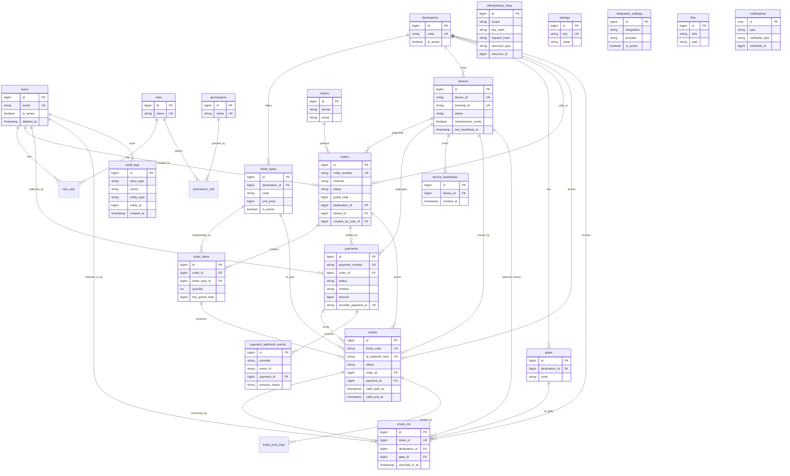

# WanderDesa — Database Design

**Document ID:** `06-DATABASE`  
**File:** `docs/06-DATABASE.md`  
**Status:** Logical/physical schema design (no migrations yet)  
**Based on:** `docs/02-PRD.md`, `docs/03-SRS.md`, `docs/04-SYSTEM-DESIGN.md`, `docs/05-BUSINESS-FLOW.md`  
**Engine:** MySQL **8.4.x** · InnoDB · utf8mb4  
**ORM target:** Laravel **13.x** Eloquent  

---

## 0. Scope and non-goals

**In scope:** Authoritative transactional schema for catalog, orders, payments, tickets, check-in, devices, RBAC, audit, settings.

**Out of scope for this document:** Migration files, seeders, query code.

**Avoided overengineering:**

- No double-entry general ledger
- No microservice databases
- No visitor CRM / loyalty schema
- No separate “kiosk orders” vs “dashboard orders” tables
- No AI mutation tables for tickets
- Heartbeat **history** kept optional/simple
- Pricing history via **order line snapshots**, not a complex price-version graph

---

## 1. Database principles

| ID | Principle |
|---|---|
| DP-01 | MySQL is the Single Source of Truth for business state |
| DP-02 | One shared schema for kiosk + assisted channels |
| DP-03 | **Money = `BIGINT` integer IDR (whole Rupiah)** everywhere — no floats, no mixed decimal standards |
| DP-04 | Critical uniqueness enforced in DB: ticket codes, idempotency keys, provider refs, check-in rules |
| DP-05 | Status fields are explicit strings (or enums via app consts); transitions enforced in Laravel domain |
| DP-06 | Soft deletes only for catalog/config entities — **never** for payments, tickets, check-ins, audit |
| DP-07 | All timestamps stored UTC (`created_at`/`updated_at` + domain event columns) |
| DP-08 | Prefer FK constraints; use `ON DELETE RESTRICT` for financial children |
| DP-09 | Idempotency and webhook event tables protect financial integrity under retries |
| DP-10 | Audit is append-only (no `deleted_at`, no update UI) |
| DP-11 | Keep table count lean; embed 1:1 QR data on tickets unless secrecy rotation needs a child row |
| DP-12 | Laravel framework tables (`jobs`, `failed_jobs`, `sessions`, `cache`, `password_reset_tokens`) used as-is when scaffolded |

### Money handling (locked)

| Rule | Detail |
|---|---|
| Type | `BIGINT NOT NULL` (IDR) |
| Example | `50000` = Rp 50.000 |
| Totals | Server-calculated; persisted on `orders` and snapshotted on `order_items` |
| Integrity | Payment `amount` must equal order `grand_total` for MVP (full pay only) |
| Forbidden | Client-supplied authoritative totals; floating point money |

### Financial integrity checklist

- Unique `orders.order_number`
- Unique `payments.payment_number`
- Unique provider payment/event IDs (nullable unique where present)
- Tickets issued only after payment `paid` (domain + supporting indexes)
- No soft delete on money/ticket/check-in rows
- Idempotency keys for create-order / initiate-payment
- Single successful check-in per MVP ticket (`check_ins.ticket_id` UNIQUE)

---

## 2. Entity list

| Group | Tables |
|---|---|
| Identity | `users`, `roles`, `permissions`, `role_user`, `permission_role` |
| Catalog | `destinations`, `ticket_types` |
| Pricing | columns on `ticket_types` + snapshots on `order_items` / `orders` (no separate price list table in MVP) |
| Visitors | `visitors` (optional lightweight; nullable FK from orders) |
| Commerce | `orders`, `order_items`, `payments`, `idempotency_keys`, `payment_webhook_events` |
| Ticketing | `tickets` (QR fields included), optional `ticket_print_logs` |
| Access | `gates` (optional), `check_ins` |
| Devices | `devices`, `device_heartbeats` |
| Ops | `audit_logs`, `notifications`, `settings`, `integration_settings`, `files` |
| Framework | `sessions`, `jobs`, `failed_jobs`, `cache`, `cache_locks` (Laravel defaults) |

**Note on “Transaction tables”:** MVP **does not** add a separate `transactions` ledger. The authoritative money movement entity is **`payments`**. Idempotency + webhook event tables provide transaction-safety.

---

## 3. User tables

### `users`

**Purpose:** Staff/internal accounts for dashboard (not public visitor logins).

| Column | Type | Nullable | Default | Notes |
|---|---|---|---|---|
| id | BIGINT UNSIGNED | NO | AI | PK |
| name | VARCHAR(120) | NO | — | |
| email | VARCHAR(190) | NO | — | UNIQUE |
| email_verified_at | TIMESTAMP | YES | NULL | |
| password | VARCHAR(255) | NO | — | hashed |
| is_active | TINYINT(1) | NO | 1 | |
| last_login_at | TIMESTAMP | YES | NULL | |
| remember_token | VARCHAR(100) | YES | NULL | |
| created_at | TIMESTAMP | YES | NULL | |
| updated_at | TIMESTAMP | YES | NULL | |
| deleted_at | TIMESTAMP | YES | NULL | soft delete OK |

**PK:** `id`  
**Unique:** `email`  
**Indexes:** `(is_active)`, `(deleted_at)`  
**Soft deletes:** Yes  
**Relationships:** roles (M:N); orders/payments/check-ins/audit as actor  

---

## 4. Role tables

### `roles`

| Column | Type | Nullable | Default | Notes |
|---|---|---|---|---|
| id | BIGINT UNSIGNED | NO | AI | PK |
| name | VARCHAR(80) | NO | — | e.g. `ticket_officer` |
| display_name | VARCHAR(120) | NO | — | |
| description | VARCHAR(255) | YES | NULL | |
| created_at | TIMESTAMP | YES | NULL | |
| updated_at | TIMESTAMP | YES | NULL | |

**Unique:** `name`  
**Soft deletes:** No (deactivate via unused / avoid delete if assigned)

### `role_user`

| Column | Type | Nullable | Default | Notes |
|---|---|---|---|---|
| user_id | BIGINT UNSIGNED | NO | — | FK → users.id |
| role_id | BIGINT UNSIGNED | NO | — | FK → roles.id |
| created_at | TIMESTAMP | YES | NULL | |

**PK:** `(user_id, role_id)`  
**FKs:** RESTRICT/CASCADE as appropriate (prefer RESTRICT on role delete)  

---

## 5. Permission tables

### `permissions`

| Column | Type | Nullable | Default | Notes |
|---|---|---|---|---|
| id | BIGINT UNSIGNED | NO | AI | PK |
| name | VARCHAR(120) | NO | — | e.g. `orders.create` |
| display_name | VARCHAR(160) | NO | — | |
| created_at | TIMESTAMP | YES | NULL | |
| updated_at | TIMESTAMP | YES | NULL | |

**Unique:** `name`

### `permission_role`

| Column | Type | Nullable | Default | Notes |
|---|---|---|---|---|
| permission_id | BIGINT UNSIGNED | NO | — | FK |
| role_id | BIGINT UNSIGNED | NO | — | FK |
| created_at | TIMESTAMP | YES | NULL | |

**PK:** `(permission_id, role_id)`

> Implementation note: equivalent Spatie-style tables are acceptable if package is adopted; semantics must match PRD permission names.

---

## 6. Destination tables

### `destinations`

**Purpose:** Tourism location / attraction unit.

| Column | Type | Nullable | Default | Notes |
|---|---|---|---|---|
| id | BIGINT UNSIGNED | NO | AI | PK |
| code | VARCHAR(40) | NO | — | UNIQUE business code |
| name | VARCHAR(160) | NO | — | |
| description | TEXT | YES | NULL | |
| timezone | VARCHAR(64) | NO | `Asia/Jakarta` | display TZ |
| is_active | TINYINT(1) | NO | 1 | |
| created_at | TIMESTAMP | YES | NULL | |
| updated_at | TIMESTAMP | YES | NULL | |
| deleted_at | TIMESTAMP | YES | NULL | soft delete OK |

**Unique:** `code`  
**Indexes:** `(is_active)`  
**Relationships:** ticket_types, devices, gates, orders  

---

## 7. Ticket type tables

### `ticket_types`

**Purpose:** Sellable ticket product under a destination.

| Column | Type | Nullable | Default | Notes |
|---|---|---|---|---|
| id | BIGINT UNSIGNED | NO | AI | PK |
| destination_id | BIGINT UNSIGNED | NO | — | FK → destinations.id |
| code | VARCHAR(40) | NO | — | unique per destination |
| name | VARCHAR(160) | NO | — | |
| description | TEXT | YES | NULL | |
| currency | CHAR(3) | NO | `IDR` | |
| unit_price | BIGINT | NO | — | IDR |
| tax_amount | BIGINT | NO | 0 | fixed tax per unit MVP (or 0 if inclusive) |
| service_fee_amount | BIGINT | NO | 0 | per unit MVP |
| validity_type | VARCHAR(30) | NO | `same_day` | `same_day`,`datetime_window`,`days_from_issue` |
| validity_days | INT UNSIGNED | YES | NULL | when applicable |
| valid_from_time | TIME | YES | NULL | optional daily window |
| valid_until_time | TIME | YES | NULL | |
| max_per_order | INT UNSIGNED | NO | 20 | |
| is_active | TINYINT(1) | NO | 1 | |
| created_at | TIMESTAMP | YES | NULL | |
| updated_at | TIMESTAMP | YES | NULL | |
| deleted_at | TIMESTAMP | YES | NULL | soft delete OK |

**PK:** `id`  
**FK:** `destination_id` → destinations(id) RESTRICT  
**Unique:** `(destination_id, code)`  
**Indexes:** `(destination_id, is_active)`  
**Constraints:** `unit_price >= 0`, tax/fee >= 0 (app + CHECK if desired)  

---

## 8. Pricing tables

**MVP decision:** No separate `prices` / `price_histories` table.

| Mechanism | Where |
|---|---|
| Current sell price | `ticket_types.unit_price`, `tax_amount`, `service_fee_amount` |
| Historical integrity | Snapshots on `order_items` + totals on `orders` |
| Discounts | `orders.discount_total` + optional `discount_code` string; complex promo engine post-MVP |

Optional later (not MVP): `ticket_type_price_schedules`.

---

## 9. Visitor tables

### `visitors`

**Purpose:** Optional lightweight visitor reference (minimal PII). **Not required** for every kiosk sale.

| Column | Type | Nullable | Default | Notes |
|---|---|---|---|---|
| id | BIGINT UNSIGNED | NO | AI | PK |
| external_ref | VARCHAR(80) | YES | NULL | optional |
| display_name | VARCHAR(120) | YES | NULL | |
| phone | VARCHAR(32) | YES | NULL | |
| email | VARCHAR(190) | YES | NULL | |
| created_at | TIMESTAMP | YES | NULL | |
| updated_at | TIMESTAMP | YES | NULL | |

**Indexes:** `(phone)`, `(email)` non-unique  
**Soft deletes:** No (or avoid collecting if unused)  
**Relationships:** optional `orders.visitor_id`

For most MVP sales, use `orders.customer_note` only and leave `visitor_id` NULL.

---

## 10. Order tables

### `orders`

**Purpose:** Commercial header shared by kiosk + assisted channels.

| Column | Type | Nullable | Default | Notes |
|---|---|---|---|---|
| id | BIGINT UNSIGNED | NO | AI | PK |
| order_number | VARCHAR(40) | NO | — | UNIQUE public id |
| destination_id | BIGINT UNSIGNED | NO | — | FK |
| channel | VARCHAR(20) | NO | — | `kiosk` \| `assisted` immutable |
| status | VARCHAR(30) | NO | `pending_payment` | see status map |
| visitor_id | BIGINT UNSIGNED | YES | NULL | FK optional |
| device_id | BIGINT UNSIGNED | YES | NULL | FK kiosk device |
| created_by_user_id | BIGINT UNSIGNED | YES | NULL | FK staff |
| currency | CHAR(3) | NO | `IDR` | |
| subtotal | BIGINT | NO | — | IDR |
| discount_total | BIGINT | NO | 0 | IDR |
| tax_total | BIGINT | NO | 0 | IDR |
| service_fee_total | BIGINT | NO | 0 | IDR |
| grand_total | BIGINT | NO | — | IDR authoritative |
| discount_code | VARCHAR(40) | YES | NULL | MVP optional unused |
| customer_note | VARCHAR(255) | YES | NULL | |
| expires_at | TIMESTAMP | YES | NULL | unpaid TTL |
| paid_at | TIMESTAMP | YES | NULL | |
| cancelled_at | TIMESTAMP | YES | NULL | |
| expired_at | TIMESTAMP | YES | NULL | |
| refunded_at | TIMESTAMP | YES | NULL | |
| created_at | TIMESTAMP | YES | NULL | |
| updated_at | TIMESTAMP | YES | NULL | |

**Status values:** `pending_payment`, `paid`, `cancelled`, `expired`, `refunded`  
**PK:** `id`  
**Unique:** `order_number`  
**FKs:** destination RESTRICT; visitor NULLABLE SET NULL; device SET NULL; user SET NULL  
**Indexes:** `(status, created_at)`, `(destination_id, created_at)`, `(channel, created_at)`, `(device_id)`, `(created_by_user_id)`, `(expires_at)`  
**Soft deletes:** **No**  
**Constraints:** `grand_total >= 0`; channel immutable in domain  

### `order_items`

| Column | Type | Nullable | Default | Notes |
|---|---|---|---|---|
| id | BIGINT UNSIGNED | NO | AI | PK |
| order_id | BIGINT UNSIGNED | NO | — | FK → orders.id |
| ticket_type_id | BIGINT UNSIGNED | NO | — | FK |
| ticket_type_code | VARCHAR(40) | NO | — | snapshot |
| ticket_type_name | VARCHAR(160) | NO | — | snapshot |
| quantity | INT UNSIGNED | NO | — | |
| unit_price | BIGINT | NO | — | snapshot IDR |
| tax_amount | BIGINT | NO | 0 | per unit snapshot |
| service_fee_amount | BIGINT | NO | 0 | per unit snapshot |
| line_subtotal | BIGINT | NO | — | qty * unit_price |
| line_tax_total | BIGINT | NO | 0 | |
| line_service_fee_total | BIGINT | NO | 0 | |
| line_grand_total | BIGINT | NO | — | |
| created_at | TIMESTAMP | YES | NULL | |
| updated_at | TIMESTAMP | YES | NULL | |

**FK:** order CASCADE; ticket_type RESTRICT  
**Indexes:** `(order_id)`, `(ticket_type_id)`  
**Soft deletes:** **No**  

---

## 11. Transaction tables

### Design choice

| Concept | Table |
|---|---|
| Money transaction | `payments` |
| Retry-safe API transaction | `idempotency_keys` |
| Provider callback transaction | `payment_webhook_events` |

### `idempotency_keys`

**Purpose:** Exactly-once semantics for critical POSTs (create order, initiate payment).

| Column | Type | Nullable | Default | Notes |
|---|---|---|---|---|
| id | BIGINT UNSIGNED | NO | AI | PK |
| key_hash | CHAR(64) | NO | — | hash of idempotency key + actor scope |
| scope | VARCHAR(40) | NO | — | e.g. `order.create`, `payment.initiate` |
| actor_type | VARCHAR(20) | NO | — | `device` \| `user` |
| actor_id | BIGINT UNSIGNED | NO | — | |
| request_hash | CHAR(64) | NO | — | payload hash |
| response_code | INT UNSIGNED | YES | NULL | |
| resource_type | VARCHAR(40) | YES | NULL | `order` \| `payment` |
| resource_id | BIGINT UNSIGNED | YES | NULL | |
| locked_at | TIMESTAMP | YES | NULL | in-progress guard |
| created_at | TIMESTAMP | YES | NULL | |
| updated_at | TIMESTAMP | YES | NULL | |

**Unique:** `(scope, actor_type, actor_id, key_hash)`  
**Indexes:** `(resource_type, resource_id)`  
**Soft deletes:** No  

---

## 12. Payment tables

### `payments`

**Purpose:** Authoritative payment records (the MVP financial transaction entity).

| Column | Type | Nullable | Default | Notes |
|---|---|---|---|---|
| id | BIGINT UNSIGNED | NO | AI | PK |
| payment_number | VARCHAR(40) | NO | — | UNIQUE |
| order_id | BIGINT UNSIGNED | NO | — | FK |
| status | VARCHAR(30) | NO | `pending` | |
| method | VARCHAR(30) | NO | — | `cash` \| `qris` \| `debit` \| `e_wallet` |
| provider | VARCHAR(40) | YES | NULL | TBD provider code |
| amount | BIGINT | NO | — | must equal order.grand_total MVP |
| currency | CHAR(3) | NO | `IDR` | |
| provider_payment_id | VARCHAR(120) | YES | NULL | unique when not null |
| provider_reference | VARCHAR(120) | YES | NULL | |
| paid_at | TIMESTAMP | YES | NULL | |
| failed_at | TIMESTAMP | YES | NULL | |
| expired_at | TIMESTAMP | YES | NULL | |
| cancelled_at | TIMESTAMP | YES | NULL | |
| refunded_at | TIMESTAMP | YES | NULL | |
| failure_code | VARCHAR(60) | YES | NULL | |
| failure_message | VARCHAR(255) | YES | NULL | |
| collected_by_user_id | BIGINT UNSIGNED | YES | NULL | cash actor |
| device_id | BIGINT UNSIGNED | YES | NULL | kiosk |
| metadata_json | JSON | YES | NULL | non-authoritative extras |
| created_at | TIMESTAMP | YES | NULL | |
| updated_at | TIMESTAMP | YES | NULL | |

**Status:** `pending`, `processing`, `paid`, `failed`, `expired`, `cancelled`, `refunded`  
**Unique:** `payment_number`; **UNIQUE** `provider_payment_id` (MySQL multiple NULLs allowed)  
**Indexes:** `(order_id, status)`, `(status, created_at)`, `(provider, status)`, `(collected_by_user_id)`  
**FK:** order RESTRICT  
**Soft deletes:** **No**  
**Constraint (domain):** only one `paid` payment per order in MVP (enforce via partial logic + unique app guard; optional generated column later)

### `payment_webhook_events`

**Purpose:** Idempotent provider webhook intake.

| Column | Type | Nullable | Default | Notes |
|---|---|---|---|---|
| id | BIGINT UNSIGNED | NO | AI | PK |
| provider | VARCHAR(40) | NO | — | |
| event_id | VARCHAR(120) | NO | — | provider event id |
| payment_id | BIGINT UNSIGNED | YES | NULL | FK when resolved |
| payload_hash | CHAR(64) | NO | — | |
| processed_at | TIMESTAMP | YES | NULL | |
| process_status | VARCHAR(20) | NO | `received` | `received`,`processed`,`ignored`,`failed` |
| created_at | TIMESTAMP | YES | NULL | |
| updated_at | TIMESTAMP | YES | NULL | |

**Unique:** `(provider, event_id)`  
**Soft deletes:** No  

---

## 13. Ticket tables

### `tickets`

**Purpose:** Issued admission rights; includes QR material (1:1).

| Column | Type | Nullable | Default | Notes |
|---|---|---|---|---|
| id | BIGINT UNSIGNED | NO | AI | PK |
| ticket_code | VARCHAR(40) | NO | — | UNIQUE public code |
| order_id | BIGINT UNSIGNED | NO | — | FK |
| order_item_id | BIGINT UNSIGNED | NO | — | FK |
| destination_id | BIGINT UNSIGNED | NO | — | FK |
| ticket_type_id | BIGINT UNSIGNED | NO | — | FK |
| payment_id | BIGINT UNSIGNED | NO | — | FK paid payment |
| channel | VARCHAR(20) | NO | — | copied from order |
| status | VARCHAR(30) | NO | `issued` | |
| currency | CHAR(3) | NO | `IDR` | |
| unit_price_snapshot | BIGINT | NO | — | |
| tax_snapshot | BIGINT | NO | 0 | |
| service_fee_snapshot | BIGINT | NO | 0 | |
| valid_start_at | TIMESTAMP | NO | — | |
| valid_end_at | TIMESTAMP | NO | — | |
| issued_at | TIMESTAMP | NO | — | |
| activated_at | TIMESTAMP | YES | NULL | |
| used_at | TIMESTAMP | YES | NULL | |
| expired_at | TIMESTAMP | YES | NULL | |
| cancelled_at | TIMESTAMP | YES | NULL | |
| refunded_at | TIMESTAMP | YES | NULL | |
| issued_by_user_id | BIGINT UNSIGNED | YES | NULL | |
| issued_by_device_id | BIGINT UNSIGNED | YES | NULL | |
| created_at | TIMESTAMP | YES | NULL | |
| updated_at | TIMESTAMP | YES | NULL | |

**Status:** `pending`, `issued`, `active`, `used`, `expired`, `cancelled`, `refunded`  
**Unique:** `ticket_code`  
**Indexes:** `(status, valid_end_at)`, `(destination_id, status)`, `(order_id)`, `(payment_id)`, `(ticket_code)`  
**FK:** all RESTRICT  
**Soft deletes:** **No**  

### `ticket_print_logs` (optional lean ops)

| Column | Type | Nullable | Default | Notes |
|---|---|---|---|---|
| id | BIGINT UNSIGNED | NO | AI | PK |
| ticket_id | BIGINT UNSIGNED | NO | — | FK |
| result | VARCHAR(20) | NO | — | `success` \| `failed` |
| actor_type | VARCHAR(20) | YES | NULL | |
| actor_id | BIGINT UNSIGNED | YES | NULL | |
| message | VARCHAR(255) | YES | NULL | |
| created_at | TIMESTAMP | YES | NULL | |

**Indexes:** `(ticket_id, created_at)`  
**Soft deletes:** No  

---

## 14. QR tables

**MVP decision:** QR payload lives on `tickets` to avoid 1:1 table sprawl.

### QR columns on `tickets` (add to §13)

| Column | Type | Nullable | Default | Notes |
|---|---|---|---|---|
| qr_payload | VARCHAR(512) | NO | — | printable/scannable content or opaque token |
| qr_payload_hash | CHAR(64) | NO | — | UNIQUE lookup/integrity |
| qr_version | SMALLINT UNSIGNED | NO | 1 | schema version |
| qr_secret_hint | VARCHAR(64) | YES | NULL | non-sensitive kid/version only |

**Unique:** `qr_payload_hash`  
**Rules:** Payload must be server-verifiable; raw forging must fail validation.

> If future key rotation needs history, add `ticket_qr_keys` later — not MVP.

---

## 15. Check-in tables

### `check_ins`

**Purpose:** Authoritative consumption of a ticket (MVP single-entry).

| Column | Type | Nullable | Default | Notes |
|---|---|---|---|---|
| id | BIGINT UNSIGNED | NO | AI | PK |
| ticket_id | BIGINT UNSIGNED | NO | — | **UNIQUE** |
| destination_id | BIGINT UNSIGNED | NO | — | FK |
| gate_id | BIGINT UNSIGNED | YES | NULL | FK optional |
| result | VARCHAR(20) | NO | `allow` | stored success rows only typically |
| checked_in_at | TIMESTAMP | NO | — | |
| checked_in_by_user_id | BIGINT UNSIGNED | YES | NULL | |
| device_id | BIGINT UNSIGNED | YES | NULL | scanner desk device if any |
| client_context | VARCHAR(120) | YES | NULL | gate code / desk |
| created_at | TIMESTAMP | YES | NULL | |
| updated_at | TIMESTAMP | YES | NULL | |

**Unique:** `ticket_id` ← **double check-in prevention**  
**Indexes:** `(destination_id, checked_in_at)`, `(gate_id, checked_in_at)`  
**Soft deletes:** **No**  
**Transaction boundary:** insert check_in + ticket status `used` in one DB transaction  

Optional `ticket_validation_attempts` (deny logging) can be added if dispute volume requires — not mandatory MVP.

---

## 16. Gate tables

### `gates`

**Purpose:** Optional physical entry points under a destination.

| Column | Type | Nullable | Default | Notes |
|---|---|---|---|---|
| id | BIGINT UNSIGNED | NO | AI | PK |
| destination_id | BIGINT UNSIGNED | NO | — | FK |
| code | VARCHAR(40) | NO | — | |
| name | VARCHAR(120) | NO | — | |
| is_active | TINYINT(1) | NO | 1 | |
| controller_type | VARCHAR(40) | YES | NULL | TBD |
| created_at | TIMESTAMP | YES | NULL | |
| updated_at | TIMESTAMP | YES | NULL | |
| deleted_at | TIMESTAMP | YES | NULL | soft OK |

**Unique:** `(destination_id, code)`  

MVP may run check-in with `gate_id = NULL` until hardware exists.

---

## 17. Kiosk / device tables

### `devices`

**Purpose:** Registered physical kiosks/terminals.

| Column | Type | Nullable | Default | Notes |
|---|---|---|---|---|
| id | BIGINT UNSIGNED | NO | AI | PK |
| device_id | VARCHAR(64) | NO | — | UNIQUE business device id |
| terminal_id | VARCHAR(64) | YES | NULL | UNIQUE if present |
| destination_id | BIGINT UNSIGNED | NO | — | FK |
| name | VARCHAR(120) | NO | — | |
| status | VARCHAR(30) | NO | `registered` | |
| is_active | TINYINT(1) | NO | 0 | 1 when active |
| maintenance_mode | TINYINT(1) | NO | 0 | |
| software_version | VARCHAR(40) | YES | NULL | |
| hardware_version | VARCHAR(40) | YES | NULL | |
| last_heartbeat_at | TIMESTAMP | YES | NULL | |
| last_ip | VARCHAR(45) | YES | NULL | |
| activation_secret_hash | VARCHAR(255) | YES | NULL | |
| registered_at | TIMESTAMP | YES | NULL | |
| activated_at | TIMESTAMP | YES | NULL | |
| deactivated_at | TIMESTAMP | YES | NULL | |
| created_at | TIMESTAMP | YES | NULL | |
| updated_at | TIMESTAMP | YES | NULL | |

**Status:** `registered`, `active`, `maintenance`, `disabled` (`offline` derived in queries)  
**Unique:** `device_id`; `terminal_id` unique nullable  
**Indexes:** `(destination_id, status)`, `(last_heartbeat_at)`, `(maintenance_mode, is_active)`  
**Soft deletes:** No (use `disabled`)  
**Device uniqueness:** enforced by `device_id` / `terminal_id`  

Sanctum token tables (`personal_access_tokens`) link to device auth as implemented.

---

## 18. Device heartbeat tables

### `device_heartbeats`

**Purpose:** Short-retention heartbeat samples for diagnostics (optional but provided).

| Column | Type | Nullable | Default | Notes |
|---|---|---|---|---|
| id | BIGINT UNSIGNED | NO | AI | PK |
| device_id | BIGINT UNSIGNED | NO | — | FK → devices.id |
| software_version | VARCHAR(40) | YES | NULL | |
| printer_ok | TINYINT(1) | YES | NULL | |
| payload_json | JSON | YES | NULL | small health blob |
| created_at | TIMESTAMP | NO | — | |

**Indexes:** `(device_id, created_at)`  
**Retention:** purge > N days via schedule (e.g. 7–14 days)  
**Note:** Authoritative “last seen” remains `devices.last_heartbeat_at`  

---

## 19. Audit tables

### `audit_logs`

**Purpose:** Append-only business evidence.

| Column | Type | Nullable | Default | Notes |
|---|---|---|---|---|
| id | BIGINT UNSIGNED | NO | AI | PK |
| actor_type | VARCHAR(20) | NO | — | `user`,`device`,`system` |
| actor_id | BIGINT UNSIGNED | YES | NULL | |
| action | VARCHAR(80) | NO | — | e.g. `payment.paid` |
| entity_type | VARCHAR(40) | YES | NULL | |
| entity_id | BIGINT UNSIGNED | YES | NULL | |
| destination_id | BIGINT UNSIGNED | YES | NULL | |
| ip_address | VARCHAR(45) | YES | NULL | |
| user_agent | VARCHAR(255) | YES | NULL | |
| before_json | JSON | YES | NULL | summary |
| after_json | JSON | YES | NULL | summary |
| meta_json | JSON | YES | NULL | |
| created_at | TIMESTAMP | NO | — | no updated_at required |

**Indexes:** `(action, created_at)`, `(entity_type, entity_id)`, `(actor_type, actor_id, created_at)`, `(destination_id, created_at)`  
**Soft deletes:** **No**  
**Updates:** **Forbidden** by application policy  

---

## 20. Notification tables

### `notifications`

Use Laravel database notifications shape:

| Column | Type | Nullable | Default | Notes |
|---|---|---|---|---|
| id | CHAR(36) | NO | UUID | PK |
| type | VARCHAR(255) | NO | — | |
| notifiable_type | VARCHAR(255) | NO | — | |
| notifiable_id | BIGINT UNSIGNED | NO | — | |
| data | TEXT | NO | — | JSON |
| read_at | TIMESTAMP | YES | NULL | |
| created_at | TIMESTAMP | YES | NULL | |
| updated_at | TIMESTAMP | YES | NULL | |

**Indexes:** `(notifiable_type, notifiable_id)`  
**MVP usage:** ops alerts (device offline, webhook failures)  

---

## 21. Reporting data requirements

Reports read **live OLTP tables** (no warehouse in MVP).

| Report | Primary sources | Key filters/indexes used |
|---|---|---|
| Daily sales by channel | `orders` (status paid/refunded), `order_items` | `(channel, created_at)`, `(status, created_at)` |
| Payments by status | `payments` | `(status, created_at)`, provider refs |
| Tickets issued vs used | `tickets` | `(status)`, `(destination_id, status)`, `used_at` |
| Refunds/cancels | `orders`, `payments`, `tickets`, `audit_logs` | status + timestamps |
| Kiosk health | `devices`, latest `device_heartbeats` | `last_heartbeat_at` |

**No materialized reporting DB** required for MVP. Optional SQL views later.

---

## 22. Settings

### `settings`

**Purpose:** System key/value configuration.

| Column | Type | Nullable | Default | Notes |
|---|---|---|---|---|
| id | BIGINT UNSIGNED | NO | AI | PK |
| key | VARCHAR(120) | NO | — | UNIQUE |
| value | TEXT | YES | NULL | |
| type | VARCHAR(20) | NO | `string` | string/int/bool/json |
| description | VARCHAR(255) | YES | NULL | |
| updated_by_user_id | BIGINT UNSIGNED | YES | NULL | |
| created_at | TIMESTAMP | YES | NULL | |
| updated_at | TIMESTAMP | YES | NULL | |

**Examples:** `order.payment_ttl_minutes=15`, `kiosk.heartbeat_stale_seconds=120`

---

## 23. Integration configuration

### `integration_settings`

**Purpose:** Provider/hardware config without hardcoding secrets in code.

| Column | Type | Nullable | Default | Notes |
|---|---|---|---|---|
| id | BIGINT UNSIGNED | NO | AI | PK |
| integration | VARCHAR(40) | NO | — | `payment`,`printer`,`scanner`,`gate`,`cctv` |
| provider | VARCHAR(60) | NO | — | TBD vendor code |
| is_active | TINYINT(1) | NO | 0 | |
| config_json | JSON | YES | NULL | non-secret config |
| secrets_encrypted | TEXT | YES | NULL | encrypted blob / references |
| created_at | TIMESTAMP | YES | NULL | |
| updated_at | TIMESTAMP | YES | NULL | |

**Unique:** `(integration, provider)`  
**Rule:** Never store raw secrets in git; encrypt at rest / use env for primary payment keys if simpler in MVP.

---

## 24. File references

### `files`

**Purpose:** Generic file metadata (logos, exports).

| Column | Type | Nullable | Default | Notes |
|---|---|---|---|---|
| id | BIGINT UNSIGNED | NO | AI | PK |
| disk | VARCHAR(40) | NO | `local` | |
| path | VARCHAR(255) | NO | — | |
| original_name | VARCHAR(255) | YES | NULL | |
| mime_type | VARCHAR(120) | YES | NULL | |
| size_bytes | BIGINT UNSIGNED | YES | NULL | |
| checksum_sha256 | CHAR(64) | YES | NULL | |
| uploaded_by_user_id | BIGINT UNSIGNED | YES | NULL | |
| created_at | TIMESTAMP | YES | NULL | |
| updated_at | TIMESTAMP | YES | NULL | |

**Indexes:** `(disk, path)` unique recommended  
**Soft deletes:** optional  

Ticket print templates may remain code-based (no DB row required).

---

## 25. Complete Mermaid ERD

---

## 26. Integrity summary (special attention)

| Concern | Enforcement |
|---|---|
| Money handling | `BIGINT` IDR on all money columns; snapshots on items/tickets |
| Financial integrity | payment amount = order grand_total (domain); no soft delete on money rows |
| Transaction boundaries | pay→issue and validate→check-in in short DB transactions |
| Idempotency | `idempotency_keys` unique scope/actor/key; webhook `(provider,event_id)` unique |
| Unique transaction IDs | `orders.order_number`, `payments.payment_number` |
| Unique ticket IDs | `tickets.ticket_code` |
| QR uniqueness | `tickets.qr_payload_hash` UNIQUE |
| Check-in uniqueness | `check_ins.ticket_id` UNIQUE |
| Device uniqueness | `devices.device_id` UNIQUE; `terminal_id` UNIQUE nullable |
| Auditability | `audit_logs` append-only + financial timestamps (`paid_at`, `used_at`, …) |

---

## 27. Soft delete policy

| Table | Soft delete? | Reason |
|---|---|---|
| users, destinations, ticket_types, gates | Yes | Catalog/config recovery |
| orders, order_items, payments, tickets, check_ins, audit_logs, idempotency_keys, payment_webhook_events | **No** | Financial/audit integrity |
| devices | No | Use `disabled` status |
| visitors | Prefer no | Minimal PII; hard-avoid orphan complexity |

---

## 28. Status field reference

| Table | Column | Values |
|---|---|---|
| orders | status | pending_payment, paid, cancelled, expired, refunded |
| payments | status | pending, processing, paid, failed, expired, cancelled, refunded |
| tickets | status | pending, issued, active, used, expired, cancelled, refunded |
| devices | status | registered, active, maintenance, disabled |
| payment_webhook_events | process_status | received, processed, ignored, failed |

Store as `VARCHAR` (app constants) for Laravel simplicity; MySQL ENUM optional but less flexible.

---

## 29. Index strategy (practical)

Beyond PKs/uniques:

1. Ops lists: `(status, created_at)` on orders/payments/tickets  
2. Destination dashboards: `(destination_id, created_at)`  
3. TTL jobs: `orders.expires_at`, unpaid payment statuses  
4. Gate: `tickets.ticket_code`, `tickets.qr_payload_hash`  
5. Fleet: `devices.last_heartbeat_at`  
6. Audit investigations: `(entity_type, entity_id)`, `(action, created_at)`  

Do not index every column “just in case.”

---

## 30. Open items before migrations

1. Confirm payment provider field lengths for refs  
2. Confirm QR payload max length for chosen scheme  
3. Confirm whether Spatie Permission package naming is adopted  
4. Confirm Sanctum token binding model for devices  
5. Confirm heartbeat history retention days (or defer `device_heartbeats` table)  
6. Confirm `order.payment_ttl_minutes` default (PRD suggests 15)  

---

## 31. Explicit non-tables (MVP)

- `kiosk_orders` / `assisted_orders` (use `orders.channel`)  
- General ledger / journal entries  
- Promo engine tables  
- CCTV detection tables (post-MVP)  
- Staff Flutter session tables  
- Multi-tenant org hierarchy  

---

*End of database design. No migrations in this document.*
